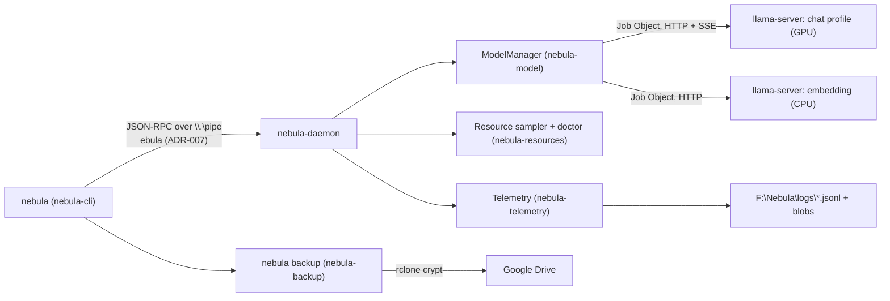

# Architecture and Code Map

A guide to what exists in the repo **today**: where things are and how they fit together. The full target design (agent loop, tools, sandboxing, self-improvement) is in [NEBULA_DESIGN.md](NEBULA_DESIGN.md). This page only describes what's built, which is Phase 0.

## The big picture

- **One daemon per machine**, started by `nebula daemon start` (detached). It owns the model servers, samples resources every 2 s, writes structured logs, and serves the CLI over a named pipe that only the current user can open.
- **The model** runs as `llama-server.exe` child processes inside a Windows Job Object. If the daemon dies, they die too. The supervisor restarts a crashed server with backoff and switches profiles on request.
- **The CLI** is a thin client. `doctor` and `resources` fall back to local checks when the daemon is down. `backup` runs in the CLI process, without the daemon.
- **Phase 1** adds the agent itself: tools over MCP, permission tiers, worktrees, an executor loop and a TUI. See the GitHub issues labelled `phase-1`.

## Crates (`crates/`)

Dependency order, from the bottom up. Each crate's `lib.rs` starts with a module doc that explains it in more detail.

| Crate | What it does | Key files | Depends on |
| --- | --- | --- | --- |
| `nebula-proto` | IPC wire types: JSON-RPC envelopes, `Method` (requests), `Event` (notifications), shared types (`ModelStatus`, `ResourceSnapshot`, `DoctorReport`, `LogEvent`), ULID trace IDs. NDJSON framing in `Message::encode`/`decode`. | `envelope.rs`, `methods.rs`, `events.rs`, `types.rs`; golden snapshots in `tests/snapshots/` | — |
| `nebula-telemetry` | `tracing` subscriber: every event becomes a `LogEvent` and is redacted, then written to daily JSONL, the console and a broadcast channel (for `logs.subscribe`). zstd blob store for large payloads. Log budget, plus the archive to `D:` with its 8 GB auto-prune. | `layer.rs`, `writer.rs`, `blobs.rs`, `budget.rs`, `redact.rs` | proto |
| `nebula-model` | `LlamaServerBackend` (chat with SSE, embeddings, tokenize, health; logs `model.call`). `ModelManager` supervisor (launch in a Job Object, health loop, restart and backoff, `Failed` state, profile switches that drain requests). `testing` module: a fake llama-server for tests. | `backend.rs`, `supervisor.rs`, `launcher.rs`, `sse.rs`, `config.rs`, `testing.rs` | proto, telemetry |
| `nebula-config` | Typed config. `config/default.toml` is **embedded in the binaries**, and `F:\Nebula\config\nebula.toml` (or `$NEBULA_CONFIG`) is merged over it. `deny_unknown_fields` everywhere. | `lib.rs` | model, telemetry |
| `nebula-resources` | GPU (NVML, plus PDH for per-process VRAM on WDDM), memory and commit charge, disks. The commit preflight before loading a model. Doctor checks that don't need the daemon (disks, SMART trend, `C:` retired, SSH firewall, logs, backup age and sign-in). | `sources.rs`, `sampler.rs`, `doctor.rs` | config, model, proto, telemetry |
| `nebula-daemon` | `start()`/`run()`: a single-instance mutex, the model manager, the sampler, the pipe server. `client.rs` is the pipe client the CLI uses. `checks.rs` holds the runtime and model-hash checks against the lock files, which are **compiled in**. `win.rs` holds the Win32 code (mutex, pipe ACL, Credential Manager). | `lib.rs`, `server.rs`, `client.rs`, `checks.rs`, `win.rs` | config, model, proto, resources, telemetry |
| `nebula-backup` | Backups: `tar.zst` with a SHA-256 manifest, retention (recent, daily, weekly, monthly), an rclone wrapper, restore with verification. | `lib.rs`, `archive.rs`, `retention.rs`, `rclone.rs` | config |
| `nebula-cli` | The `nebula` binary (clap). Commands: `daemon start\|stop\|status`, `chat`, `model status\|profile <name>`, `logs tail`, `resources`, `doctor`, `backup now\|list\|restore\|reauth`. `--json` on everything. | `lib.rs` (commands), `chat.rs`, `daemon_ctl.rs`, `backup.rs`, `format.rs`, `win.rs` | all of the above |

Binaries: `nebula.exe` (from `nebula-cli`) and `nebula-daemon.exe` (from `nebula-daemon`), installed to `F:\Nebula\bin\` by `scripts/install-nebula.ps1`.

### Where to look for…

| Question | Place |
| --- | --- |
| Add or change an IPC method | `nebula-proto/src/methods.rs` (+ `NAMES`), handler in `nebula-daemon/src/server.rs`, client call in `nebula-cli/src/lib.rs`; accept the snapshot diff |
| Add a doctor check | Local checks: `nebula-resources/src/doctor.rs`. Checks that need the daemon or the lock files: `nebula-daemon/src/checks.rs` |
| Add a config key | `config/default.toml` and the struct in `nebula-config/src/lib.rs` (unknown keys fail) |
| Model launch flags and profiles | `[model.profiles.*]` in `config/default.toml`, turned into `llama-server` arguments by `ModelProfile::args` in `nebula-model/src/config.rs` |
| Restart and backoff behaviour | `nebula-model/src/supervisor.rs` |
| What gets logged and redacted | `nebula-telemetry/src/layer.rs`, `redact.rs`; the secret targets are `daemon.secrets` in config |
| CLI output format | `nebula-cli/src/format.rs` (snapshot-tested in `tests/snapshots/`) |

## Runtime layout on disk

Hard-coded defaults; all of them can be changed in config. Tests redirect every path to a temp dir.

| Path | Contents |
| --- | --- |
| `F:\Nebula\bin\` | Installed `nebula.exe` and `nebula-daemon.exe` |
| `F:\Nebula\runtime\llama-prism\…`, `llama-stock\…` | Pinned llama.cpp builds (`config/runtime.lock.toml`) |
| `F:\Nebula\models\` | GGUF models (`config/models.lock.toml`) |
| `F:\Nebula\logs\` | Daily `nebula-YYYY-MM-DD.jsonl`, `blobs\<2 hex>\*.zst` |
| `F:\Nebula\state\` | `smart\` (SMART JSON), the model-hash cache, `doctor.json`, `backup-last.json`, `backup-auth.json` |
| `F:\Nebula\config\` | `nebula.toml` (local override), `rclone.conf` (encrypted) |
| `F:\Nebula\build\target` | `CARGO_TARGET_DIR` (with sccache) |
| `D:\NebulaCold\` | Cold data: `logs-archive\`, `backups-local\`, `models-archive\`, `restore\`, `downloads\` |
| `C:` | **Retired, failing drive.** Nothing may live there; doctor fails if a configured path resolves to it |

Secrets live in Windows Credential Manager (`nebula/github_bot_token`, `nebula/rclone_config_pass`, …) and are masked in all logs.

## Model profiles

From [ADR-004](adr/ADR-004-model-profiles.md), [ADR-005](adr/ADR-005-fallback-model.md) and [ADR-006](adr/ADR-006-mtp-speculative-decoding.md); defined in `config/default.toml`.

| Profile | Model | Context | Runtime |
| --- | --- | --- | --- |
| `standard` (default) | Bonsai 2 27B PQ2_0 with an MTP head (speculative decoding) | 32K | llama-prism |
| `long` | Bonsai 2 27B PTQ1_0 | 128K | llama-prism |
| `lean` | Bonsai 2 27B PTQ1_0 | 16K | llama-prism |
| `embedding` | Qwen3-Embedding 0.6B, CPU | 1K | llama-stock |
| fallback | Gemma 4 26B-A4B MoE (ADR-005); bench profile only, not yet a daemon profile | 32K | llama-stock |

## Other top-level folders

| Folder | What's there |
| --- | --- |
| `bench/` | Python (uv) benchmark and smoke-test harness: `nebula_bench/` (server launcher, perf, quality, needle, tool calls, MTP, embedding), `profiles/*.toml` (llama-server profiles), `results/<date>/` (reports and raw data behind the ADRs). Run with `uv run nebula-smoke --profile pq2mtp`. |
| `config/` | `default.toml` (embedded defaults), `runtime.lock.toml` and `models.lock.toml` (pins with SHA-256; embedded in the daemon for doctor) |
| `scripts/` | PowerShell ops scripts: `install-nebula.ps1`, `bot-push-pr.ps1`, `register-backup-tasks.ps1`, `store-*.ps1` (Credential Manager), `install-hooks.ps1`, and the one-off Phase 0 machine setup (`phase0-*.ps1`, `set-pagefile.ps1`, `smart-snapshot.ps1`) |
| `docs/` | Design, plan, ADRs, ops runbooks; see [the docs index](#docs-index) |
| `.githooks/` | gitleaks pre-commit and pre-push hooks |
| `.github/` | CI (`workflows/ci.yml`: gitleaks, bench, Rust fmt/clippy/nextest, aggregated as **CI ok**), issue templates, `CODEOWNERS` |

## Docs index

| Doc | Read it when |
| --- | --- |
| [NEBULA_DESIGN.md](NEBULA_DESIGN.md) | You need the target architecture or the reasoning. It's long; use the table of contents. Section 4 is architecture, 5 the agent, 6 tools, 7 command-line access and security, 9 cloud escalation and Cursor, 10 logging, 11 self-improvement, 12 the roadmap |
| [PHASE0_PLAN.md](PHASE0_PLAN.md) | You want what Phase 0 built and why. Look for the "As built" notes under each workstream; Section 9 has the exit criteria |
| [adr/](adr/README.md) | You're about to change a decision: model profiles, fallback, MTP, IPC framing, Rust/Python split, MCP boundary |
| [ops/setup.md](ops/setup.md) | You're rebuilding the machine, or need to know how something was installed |
| [ops/phase0-notes.md](ops/phase0-notes.md) | You want dated results and findings from the real machine (the hardware quirks are here) |
| [ops/backup.md](ops/backup.md) | Backups, restore, the weekly Google sign-in renewal |
| [ops/runtime-upgrade.md](ops/runtime-upgrade.md), [ops/replace-nvme.md](ops/replace-nvme.md), [ops/retire-c-drive.md](ops/retire-c-drive.md) | Runbooks |
| [bench/results/](../bench/results/) | Benchmark reports behind ADR-004 to ADR-006 |
| [CONTRIBUTING.md](../CONTRIBUTING.md) | Branch, commit, PR and Rust conventions |
| [AGENTS.md](../AGENTS.md) | You're an AI agent working in this repo: start here |
