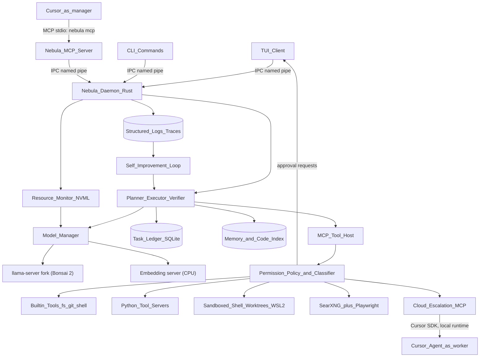
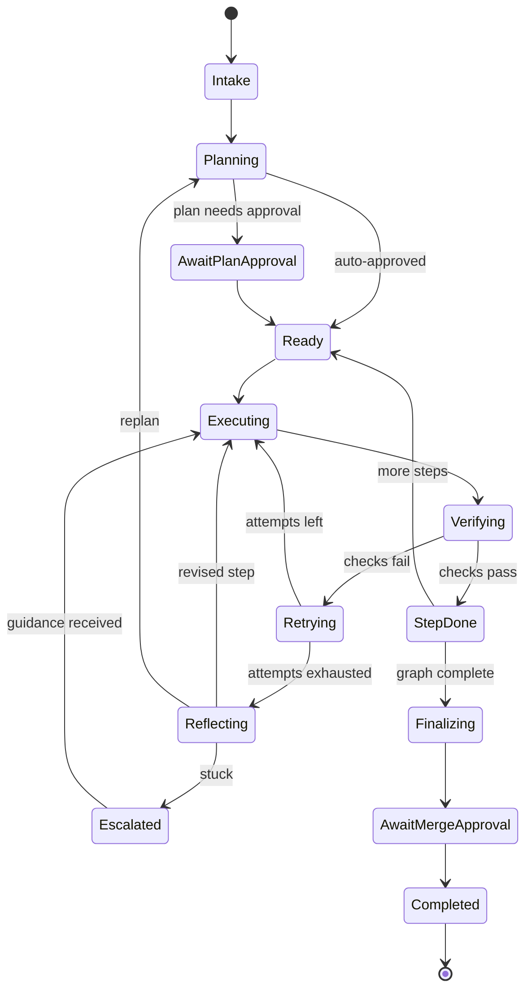
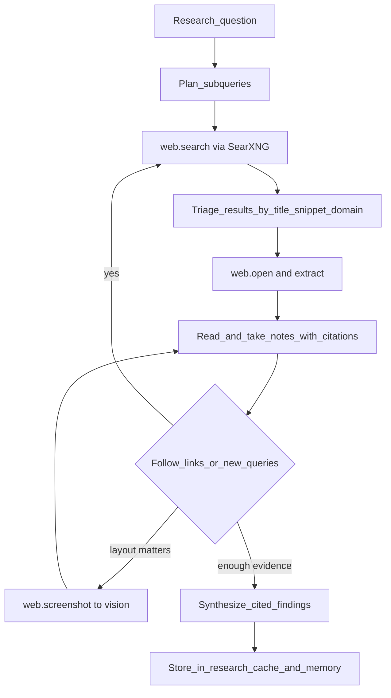
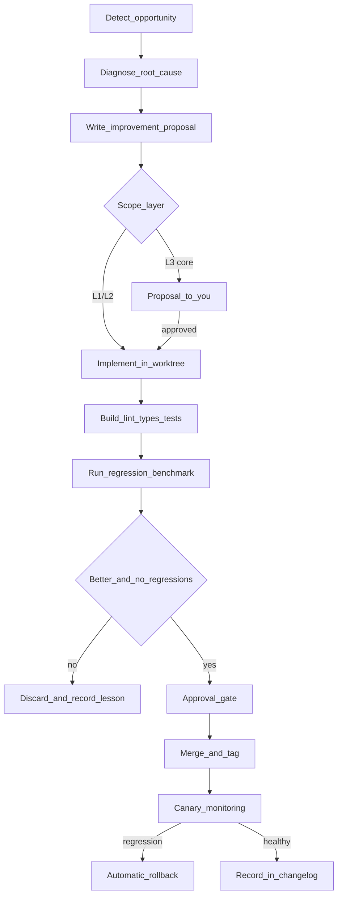
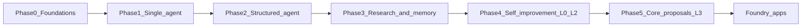

# Project Nebula — Technical Design Document

| Field | Value |
| --- | --- |
| Status | Draft v0.1 (pre-implementation) |
| Date | 2026-09-30 |
| Owner | You ("the man in the chair") |
| Previous name | Project Neutron |
| Scope | Architecture, subsystems, bootstrap roadmap, risks. No code. |

---

## Table of Contents

1. [Vision and Tenets](#1-vision-and-tenets)
2. [Hardware and Resource Budget](#2-hardware-and-resource-budget)
3. [Language and Stack Rationale](#3-language-and-stack-rationale)
4. [System Architecture](#4-system-architecture)
5. [Agent Design](#5-agent-design)
6. [Tool System](#6-tool-system)
7. [Command-Line Access and Security](#7-command-line-access-and-security)
8. [Web Research Subsystem](#8-web-research-subsystem)
9. [Cloud Escalation and Cursor Integration](#9-cloud-escalation-and-cursor-integration)
10. [Logging and Observability](#10-logging-and-observability)
11. [Self-Improvement Framework](#11-self-improvement-framework)
12. [Bootstrap Roadmap](#12-bootstrap-roadmap)
13. [Risk Register](#13-risk-register)
14. [Open Questions](#14-open-questions)

---

## 1. Vision and Tenets

### 1.1 Vision

Nebula is a **local-first AI coding agent** that can take a software task from idea to working, tested code with no cloud dependency. It is the first member of a planned **AI foundry**: a family of local AI applications that increase your productivity so you can focus on your studies. Nebula's special job in that family is to **build the others**, and increasingly to build and improve itself.

The project follows a bootstrap arc:

1. You build Nebula's minimal core by hand, with AI assistance.
2. Nebula becomes able to do real coding tasks under your supervision.
3. Nebula starts improving its own tools, prompts and workflows.
4. Nebula proposes (and, once trusted, implements) changes to its own core.
5. Nebula builds the sibling foundry apps.

### 1.2 Tenets

Tenets are split into **hard rules** (the system enforces them; breaking one is a bug) and **goals** (we optimize toward them and trade them off against each other).

**Hard rules**

| # | Rule | Enforcement |
| --- | --- | --- |
| H1 | All reasoning runs on local models. There is no built-in cloud inference path. | The model manager only talks to local backends. Cloud access exists solely as the `escalate` MCP tool (Section 9). |
| H2 | Cloud AI is only reachable through explicitly registered MCP tools, and each use needs your approval and fits within a budget. | Tool permission tier 3, budget ledger, and an audit log. |
| H3 | Every action is logged: every model call, tool call, command, file write and approval. | The logging layer sits below the tool host; tools cannot skip it. |
| H4 | Changes to Nebula's own code go through a worktree, evals and your approval before they merge. | A self-modification pipeline with protected branches (Section 11). |
| H5 | Destructive or system-level actions need your approval. | Command classifier plus permission tiers (Section 7). |
| H6 | Every change must be reversible. | Git for code, snapshots for config, rollback commands. |

**Goals**

- **Finishes the job end to end**: plan, implement, test, fix, document.
- **Knows its environment**: it knows its hardware, what is using it, and how to make room when it needs to.
- **Improves itself**: it creates new tools, workflows and features that make future tasks possible.
- **Researches like a person**: it searches, reads, follows links and cross-checks sources.
- **Performance**: low overhead around the model, fast startup, fast tool calls.
- **Diagnosable**: when something fails, you or Nebula can find out why from the logs alone.

### 1.3 Out of Scope (for now)

- GUI or web frontends (the terminal UI comes first; the daemon design keeps other frontends possible).
- Multi-user or networked deployment. Nebula is single-user and single-machine.
- Training or fine-tuning models. Self-improvement means code, tools, prompts and workflows, not weights. LoRA fine-tuning is a possible later research track (Section 14).
- Extracting a shared "foundry core" library. Nebula is built first; module boundaries are kept clean so the extraction is cheap later.
- Mobile or cross-platform support. The target is Windows 11, with WSL2 used as a sandbox.

---

## 2. Hardware and Resource Budget

### 2.1 Baseline Machine

| Component | Spec | Role |
| --- | --- | --- |
| GPU | NVIDIA RTX 4070 OC, 12 GB GDDR6X | Primary model inference |
| System RAM | 32 GB | Daemon, tools, browser, embedding model, CPU offload, WSL2 |
| OS | Windows 11 (build 26200) | Host; WSL2 used as a sandbox |
| CPU | Intel i7-10700K, 8 cores / 16 threads, overclocked to 5 GHz | Embedding model, tool processes, builds, Chromium |
| Storage (hot) | Samsung 980 1 TB NVMe (`F:`), the Windows drive; ~105 GB free for Nebula | OS, toolchains, page file, active models, worktrees, build output, hot logs, sandbox distro |
| Storage (cold) | WD Blue 1 TB HDD (`D:`), ~244 GB free. Approved for Nebula use inside `D:\NebulaCold\`; big deletes need your approval. | Model archive, log archive, research cache, backup staging, SearXNG distro |
| Old drive | WD 240 GB SATA SSD (`C:`), **failing but still connected and still holding the boot loader** | Nothing. Never touched; retired later (see [PHASE0_PLAN.md](PHASE0_PLAN.md) Section 3.1) |

**Design principle:** the architecture must work well on this baseline. Any extra VRAM, RAM or clock speed only adds throughput and context length. Nothing may *require* more than the baseline.

### 2.2 Primary Model: Ternary Bonsai 2 27B

| Property | Value | Source / confidence |
| --- | --- | --- |
| Base | Qwen3.8-27B (hybrid attention, ~75% linear / ~25% full) | PrismML model card |
| Parameters | 27.36B (24.35B backbone, 2.54B embed/head, 0.46B vision) | Model card |
| Weight format | Ternary {−1, 0, +1} with FP16 group scale (g128) | Model card |
| File size | 5.95 GB (PTQ1_0, 1.75 bpw) or 7.21 GB (PQ2_0, 2.13 bpw) | Model card |
| Vision tower | Optional mmproj, ~0.63 GB (Q8_0), loaded only when needed | Model card |
| Max context | 262,144 tokens | Model card |
| Runtime | PrismML's llama.cpp fork (`prism` branch); prebuilt Windows x64 CUDA 12.4 binaries exist. Stock llama.cpp cannot run it (upstreaming is in progress). | PrismML docs |
| Tool calling | Native OpenAI-style `tool_calls` through llama-server | PrismML docs |
| Speculative drafter | Paired "dspark" drafter GGUF ships with the 27B; ~1.8–2x faster decode on CUDA (experimental) | PrismML docs |
| License | Apache 2.0 | Model card |
| Aggregate retention | 98.2% of FP16 | Vendor-reported, not independently reproduced |
| Agentic retention | **~75%** on SWE-bench Verified (60.8 vs 80.6) and Terminal-Bench 2.1 (52.8 vs 69.7) | Vendor table |

**The consequence:** the model is close to lossless at single-shot coding and math, but noticeably weaker at long-horizon, multi-turn agent work. That is precisely Nebula's workload. **The architecture makes up for it with structure** (Section 5): small bounded steps, state kept outside the model, mandatory verification, and fresh contexts.

**Default format:** PTQ1_0 (5.95 GB). PQ2_0 (7.21 GB) is the alternative if Phase 0 benchmarks show a meaningful quality gain; it costs about 1.3 GB of KV-cache headroom.

### 2.3 VRAM Budget (12 GB)

KV-cache sizes are **vendor-documented**; the other rows are planning estimates to be measured in Phase 0 (Section 12).

| Consumer | PTQ1_0 plan | PQ2_0 plan | Notes |
| --- | --- | --- | --- |
| Windows desktop / DWM / browser GPU use | 1.0 GB | 1.0 GB | Kept as a reserve; varies with monitors and apps |
| Model weights | 5.95 GB | 7.21 GB | |
| CUDA context + compute buffers | 0.8 GB | 0.8 GB | Depends on batch size and the fork's kernels |
| Linear-attention recurrent state | ~0.1 GB | ~0.1 GB | Fixed size per sequence, independent of context length |
| KV cache (full-attention layers only) | up to ~3.5 GB | up to ~2.3 GB | The part that grows with context |
| Vision mmproj (on demand) | 0 / 0.63 GB | 0 / 0.63 GB | Loaded only for screenshot/image tasks |
| Safety margin | ~0.5 GB | ~0.5 GB | Prevents OOM and driver spill into shared memory |

**KV-cache sizing.** Only the ~25% full-attention layers keep a per-token KV cache. PrismML documents **64 KiB/token at FP16** and **~18 KiB/token with the 4-bit (q4_0) KV cache**. The 4-bit cache needs flash attention and is slightly slower to decode. A one-time, model-specific calibration bias (`llama-kv-mean-center`) recovers most of its quality loss.

| Context tokens | KV at FP16 | KV at q4_0 | Fits the PTQ1_0 budget? |
| --- | --- | --- | --- |
| 32K | 2.0 GiB | ~0.56 GiB | Yes, comfortably, even at FP16 |
| 64K | 4.0 GiB | ~1.1 GiB | FP16 is borderline; q4_0 is comfortable |
| 128K | 8.0 GiB | ~2.25 GiB | Only with q4_0 |
| 262K | 16 GiB | ~4.5 GiB | Technically possible with q4_0, with no other GPU apps and no vision; not a planning target |

**Planning targets:**

- **Default working context: 32K tokens per sub-agent call, FP16 KV** (best quality, ~2 GiB). This is deliberately small. Short, focused contexts are also the main tool for coping with the model's weak long-horizon behavior.
- **Extended context: up to 128K with q4_0 KV** for specific jobs (reading a large file set, long research syntheses), requested explicitly by the orchestrator.
- Never rely on more than that. Long-term knowledge lives in the memory system (Section 5.4).

**Prompt caching on a hybrid model.** Because 75% of the layers carry recurrent state rather than a KV cache, plain prefix reuse needs **context checkpoints**. llama-server is launched with `--ctx-checkpoints N` (e.g. 32), `--cache-ram` (a system-RAM budget for saved prompt state, e.g. 4096 MiB), and `--cache-idle-slots`, and every request sets `cache_prompt: true`. `--cache-reuse` (chunk shifting) is not available for this model. Any change to the leading text or to the order of tools shrinks the reusable prefix, which is why Section 5.5 keeps the system prompt and tool list stable and first.

**Speculative decoding.** The paired dspark drafter gives ~1.8–2x faster decode on CUDA, but in the current fork it **disables cross-request prompt-cache reuse and forces a single slot**. That is a bad trade for the agent loop, which resends a long shared prefix on every call. It is used only by an opt-in `burst` profile for long single-shot generations (for example writing a large new file from a finished spec). Re-test in Phase 0 and on each fork update.

**Concurrency:** one active sequence at a time by default (a single slot in llama-server). Parallel slots split the KV budget; that is an experiment for Phase 2 (for example, a verifier running alongside an executor).

### 2.4 System RAM Budget (32 GB)

| Consumer | Estimate | Notes |
| --- | --- | --- |
| Windows + your apps | 8–10 GB | Reserve |
| Nebula daemon (Rust) | 100–300 MB | Includes the SQLite page cache |
| Python tool servers | 200 MB–1 GB | Depends on active tools |
| Embedding model (CPU) | 0.5–1.5 GB | Small embedding model, e.g. a ~0.6B class model in GGUF form |
| Code index + vector store | 100 MB–1 GB | sqlite-vec, memory-mapped |
| Headless Chromium (Playwright) | 0.5–2 GB | Heavy; started on demand and stopped when idle |
| WSL2 VM | 2–6 GB | Capped via `.wslconfig`; started on demand |
| SearXNG | ~200 MB | Native install inside WSL2 (no Docker) |
| llama-server prompt cache (`--cache-ram`) | 2–4 GB | Saved prompt state/checkpoints for fast prefix reuse |
| Headroom | 8+ GB | |

**Disk budget (two tiers).** `F:` (NVMe) holds Windows and has ~105 GB free for Nebula. `D:` (1 TB HDD, ~244 GB free) takes bulk data that doesn't need speed. `C:` is never used.

| Item | Drive | Budget | Notes |
| --- | --- | --- | --- |
| Toolchains: VS Build Tools (MSVC), Rust, uv, Node, misc. | `F:` | ~18 GB | CUDA toolkit installed only if the fork must be built from source |
| Page file (moved off `C:`) | `F:` | 4–12 GB | |
| Active models | `F:` | ~16 GB | Bonsai PTQ1_0 + drafter + mmproj + KV bias, chosen fallback, embedding model. Kept on the NVMe for fast loading (game-mode resume). |
| Rust build output | `F:` | ~10 GB | Shared `CARGO_TARGET_DIR`, `sccache` capped at 6 GB, weekly `cargo sweep` |
| Worktrees, package caches, state DB | `F:` | ~8 GB | Finished worktrees pruned automatically |
| Hot logs (7 days) | `F:` | ~2 GB | |
| WSL2 sandbox distro (Phase 2) | `F:` | ~8 GB | Needs SSD speed for builds |
| Model archive | `D:` | ~20 GB | Benchmark candidates and old versions, so they never need re-downloading |
| Log archive + blob overflow | `D:` | ~8 GB | |
| Research cache | `D:` | ~10 GB | |
| Backup staging | `D:` | ~5 GB | |
| WSL2 SearXNG distro | `D:` | ~5 GB | |

`F:` total ≈ 60–70 GB at steady state, leaving ~35–45 GB free. `D:` uses ~50–60 GB of its free space.

**Disk guard.** Because the OS lives on `F:`, low disk space there can destabilize Windows itself (page file, updates). The resource monitor tracks both drives:

- **`F:` below 30 GB free:** warn you, and run cleanup automatically (prune worktrees, sweep build output, move old logs and models to `D:`, trim caches).
- **`F:` below 20 GB free:** refuse to start new tasks, builds or downloads.
- **`F:` below 12 GB free:** pause running tasks.
- **`D:` below 50 GB free:** warn. **Below 25 GB:** stop archive writes.
- Automatic cleanup at any threshold still follows the **big-delete rule** (Section 7.6). Anything above 1 GB is proposed to you as one grouped approval.

**Living with an aging NVMe (`F:`).** The Samsung 980 has logged bad blocks but stays in service for about a year. To reduce wear and risk:

- **Fewer writes to `F:`:**
  - large downloads land on `D:` first and only the final model file is moved to `F:`
  - log blobs older than 7 days and benchmark raw data go to `D:`
  - `sccache` is capped
  - `cargo sweep` runs weekly
  - the llama-server prompt cache lives in RAM (`--cache-ram`), never on disk
- **Health tracking:** `smartctl` (smartmontools) runs monthly and after any new disk error event, through an elevated scheduled task that writes JSON for `nebula doctor`. It records media errors, available spare, percentage used and temperature over time. A rise in media errors, or available spare falling below its threshold, alerts you on every device.
- **Replacement readiness:** all data paths come from `config.toml`, so moving to a new NVMe means clone or reinstall, restore the latest backup, and change one setting. This is documented in `docs/ops/replace-nvme.md`.

### 2.5 Resource Monitor

A daemon subsystem that samples, publishes and acts on resource state.

**Sources**

- **GPU:** NVML (through `nvml-wrapper`) for VRAM used/free, utilization, temperature, clocks, power, and **per-process GPU memory**. That last item is key for spotting which app is using VRAM.
- **CPU/RAM/disk/processes:** `sysinfo`.
- **Model backend:** llama-server `/metrics` and `/slots` endpoints: tokens/s, context in use, queue depth.

**Outputs**

- A live `ResourceSnapshot` sent on the internal event bus every 1–2 s, shown in the terminal UI status bar.
- A **resource summary injected into agent context** on request, through a `system.resources` tool, so the agent can reason about its environment ("VRAM is 11.1/12 GB, Chrome is using 1.4 GB").
- Time-series samples written to the log store for later analysis.

### 2.6 "Free Up Resources Smartly" Policy

When a task needs resources that are not available, the resource manager works down an **escalation ladder**, stopping at the first step that frees enough:

| Step | Action | Needs approval? |
| --- | --- | --- |
| R0 | Unload Nebula's own optional components: vision mmproj, idle browser, idle WSL2, drafter | No |
| R1 | Shrink the requested context or KV precision (for example FP16 to q4_0 KV); summarize and compact working context | No |
| R2 | Defer or queue the task until resources free up naturally | No (you are notified) |
| R3 | Ask you to close or pause specific processes, naming them with measured usage ("Chrome: 1.4 GB VRAM") | **Yes** |
| R4 | Close or suspend processes from a **user-maintained allowlist** (for example "OK to kill: Discord, Steam") | Pre-approved via the allowlist; otherwise yes |
| R5 | Switch to a smaller or lower-precision model profile | No (logged); you can pin a profile to prevent this |

Rules:

- Nebula **never** kills processes that are not on the allowlist without explicit approval.
- It never touches system processes or anything with unsaved-state heuristics (for example an editor with dirty buffers), even if allowlisted, without confirming first.
- Every action on the ladder is logged with before/after snapshots.
- Nebula never closes or suspends a game.

**Game mode.** You sometimes game while Nebula might be working, so contention with a game is handled separately from the ladder:

- **Detection:** a fullscreen or exclusive-fullscreen foreground app, a process from a configurable game list (Steam/Epic/Battle.net children and named executables), or another process holding more than a set amount of VRAM (e.g. 2 GB).
- **Response:** finish or checkpoint the current step, then **pause all tasks and unload the model** to free all of Nebula's VRAM. Light CPU-only work (indexing, log mining) can optionally continue at low priority.
- **Resume:** automatically when the game exits (with a short cooldown), or when you run `nebula resume`.
- Detection and pause/resume events are logged and shown in the TUI.

**Model profiles** (config-driven, switchable at runtime):

| Profile | Weights | KV | Context | Use |
| --- | --- | --- | --- | --- |
| `standard` | PTQ1_0 | FP16 | 32K | Default |
| `long` | PTQ1_0 | q4_0 + bias | 128K | Big reads / synthesis |
| `quality` | PQ2_0 | FP16 | 32K | If benchmarks show gains |
| `vision` | PTQ1_0 + mmproj | FP16 | 24K | Screenshots, UI work |
| `lean` | PTQ1_0 | q4_0 + bias | 16K | When VRAM is contested |
| `burst` | PTQ1_0 + dspark drafter | FP16 | 16K | Long single-shot generation; no prompt-cache reuse. **Parked (2026-10-02): no Bonsai 2 drafter has been released yet** (see 5.5.1). |
| `fallback` | Ornith-1.0-9B Q6_K (7.36 GB) on stock llama.cpp | FP16 | 32K | If the fork is broken or unavailable |

**Fallback model.** Ornith-1.0-9B (MIT license; post-trained from Gemma 4 and Qwen 3.5 for terminal agents and tool calling) replaces the originally suggested Qwen 3.5 9B. Its vendor reports 43.1 on Terminal-Bench 2.1 against 21.3 for Qwen3.5-9B, versus 52.8 for Bonsai 2. It runs on **stock** llama.cpp, which is the point of a fallback. Qwen3.5-DeltaCoder-9B is the second candidate. Both are compared on Nebula's own benchmark in Phase 0 before one is chosen.

---

## 3. Language and Stack Rationale

> ADR-001 to ADR-003 are also kept as standalone records in [docs/adr/](adr/), which are the source of truth for decisions from now on.

### ADR-001: Rust core with Python tools

**Status:** Accepted (2026-09-30)

**Context.** Nebula has two very different kinds of code:

1. **The core**: a long-running daemon, concurrency (model streaming, tool processes, the terminal UI, monitoring), process supervision, sandboxing via Win32 APIs, structured logging, and IPC. It needs to be correct, fast, crash-resistant and low-overhead, and it changes slowly.
2. **The periphery**: tools, workflows, research scrapers and integrations. It changes constantly, and **Nebula itself will write most of it**. It needs to be easy for a local 27B model to write correctly, quick to iterate on, and backed by a large ecosystem.

**Decision.** Rust for the core, Python for the periphery. The boundary between them is **MCP** (Model Context Protocol) over stdio/JSON-RPC, a standard, language-neutral protocol.

**Options considered**

| Option | Pros | Cons | Verdict |
| --- | --- | --- | --- |
| **Rust core + Python tools** | Best runtime performance and memory safety in the core; excellent Windows API access (`windows-rs`); strong async (`tokio`); Python periphery is the language models write best; huge ecosystem (Playwright, parsing, ML) | Two languages; Rust compiles slowly; LLMs make more mistakes in Rust (borrow checker) | **Chosen.** The core changes rarely and is human-reviewed (layered self-modification), so Rust's difficulty for the model matters least exactly where Rust is used. |
| Go core + Python tools | Fast compiles; simpler language the model writes well; good concurrency | GC pauses (minor); weaker Win32 ergonomics; less expressive types for the protocol and state machines | Strong runner-up. Revisit if Rust slows bootstrap too much. |
| Python only | Fastest bootstrap; one language; the model can self-edit everything | GIL/perf limits in the orchestrator; weaker robustness for a long-running daemon; packaging/distribution pain on Windows; dynamic typing hides errors in self-modified code | Rejected for the core. |
| TypeScript / Node | Best MCP ecosystem; good async | Heavier runtime; weaker systems access; not your background | Rejected. |

**Consequences**

- Self-modification in v1 targets Python and config (Section 11). The Rust core gets **proposals** that you review. This matches both the language split and the trust model.
- The protocol between core and tools is versioned and schema-checked, so the model can't break the core by writing a bad tool.
- Rust compile times are managed with a workspace of small crates, `sccache`, a fast linker (`rust-lld`), and incremental builds in dev.
- Python environments are managed with `uv`, which is fast, lockfile-based and Windows-friendly. Each tool server gets an isolated environment or a shared, locked environment.

### ADR-002: MCP as the universal tool boundary

**Decision.** Every tool, built-in or generated, is exposed through MCP. Built-in Rust tools (filesystem, shell, git) implement the same interface in-process. External and Python tools run as MCP servers over stdio.

**Why:** one protocol for everything; tools written for Nebula also work with other MCP clients, and third-party MCP servers (including the cloud escalation tool) plug in without special cases.

### ADR-003: llama.cpp (PrismML fork) behind a backend trait

**Decision.** The model runs as a supervised **`llama-server` child process** (PrismML fork) exposing an OpenAI-compatible HTTP API on localhost. Nebula talks to it through a `ModelBackend` trait.

**Why a separate process rather than linking the library:** crash isolation (a CUDA fault does not kill the daemon), easy upgrades of the fork, and the same code path works for vanilla llama.cpp or other backends later (vLLM on WSL2, a future PrismML runtime, etc.).

### 3.1 Core Stack (Rust)

| Concern | Choice | Notes |
| --- | --- | --- |
| Async runtime | `tokio` | Named pipes, processes, timers |
| Logging / tracing | `tracing`, `tracing-subscriber`, `tracing-appender` | JSON output, span-based trace IDs |
| Serialization | `serde`, `serde_json` | Protocol, config, logs |
| Config | `toml` + `figment` (or similar layered config) | Defaults, then user file, then env |
| HTTP client | `reqwest` | llama-server, SearXNG |
| MCP | `rmcp` (official Rust MCP SDK) | Client for tool servers, server for built-ins |
| Storage | `rusqlite` + `sqlite-vec` extension | Task ledger, memory, vectors, log index |
| Code parsing | `tree-sitter` + language grammars | Code index, symbol maps |
| GPU telemetry | `nvml-wrapper` | VRAM, per-process usage |
| System telemetry | `sysinfo` | CPU, RAM, processes |
| Windows APIs | `windows` (windows-rs) | Job Objects, named pipes, process control |
| Git | Shell out to `git` (primary), `gix` for fast reads | Worktrees are simplest via the CLI |
| Terminal UI | `ratatui` + `crossterm` | Works in Windows Terminal |
| CLI parsing | `clap` | `nebula` command |
| Errors | `thiserror` (libraries), `anyhow` (binaries) | |
| Testing | `cargo nextest`, `insta` (snapshots), `proptest` | |

### 3.2 Periphery Stack (Python)

| Concern | Choice |
| --- | --- |
| Environment / packaging | `uv` |
| MCP servers | Official `mcp` Python SDK |
| Browser automation | Playwright (Chromium) |
| Content extraction | `trafilatura` / readability-style extraction, `markdownify` |
| Validation | `pydantic` |
| Testing | `pytest` |
| Lint / format / types | `ruff`, `pyright` (required checks on generated tools) |

### 3.3 External Services (local)

| Service | Where it runs | Purpose |
| --- | --- | --- |
| `llama-server` (PrismML fork) | Native Windows, CUDA | Primary model |
| Embedding server | Native Windows, CPU (llama.cpp `--embedding`) | Memory and code index |
| SearXNG | Native install inside a WSL2 distro, run as a systemd service (no Docker) | Private metasearch |
| Chromium (Playwright) | Native Windows, headless | Web browsing |

### 3.4 Repository Layout (proposed)

```
nebula/
  Cargo.toml                 # Rust workspace
  crates/
    nebula-daemon/           # binary: the long-running service
    nebula-cli/              # binary: `nebula` command + TUI
    nebula-proto/            # IPC + event types (shared by daemon and TUI)
    nebula-orchestrator/     # planner/executor/verifier, task graph
    nebula-model/            # ModelBackend trait, llama-server supervisor, profiles
    nebula-tools/            # MCP host, registry, built-in tools
    nebula-sandbox/          # permission tiers, classifier, Job Objects, WSL2 bridge
    nebula-memory/           # ledger, episodic memory, code index, vectors
    nebula-resources/        # NVML/sysinfo monitor, resource ladder
    nebula-telemetry/        # logging, traces, replay
  tools/                     # Python MCP tool servers (self-modifiable zone)
    web_research/
    ...
  workflows/                 # declarative workflow definitions (self-modifiable)
  prompts/                   # versioned prompt templates (self-modifiable)
  evals/                     # regression benchmark tasks + harness
  config/                    # default config, profiles, permission policy
  docs/
```

Crates in `nebula-model`, `nebula-tools`, `nebula-sandbox`, `nebula-memory`, `nebula-resources` and `nebula-telemetry` are written **app-agnostic on purpose**. They are the future "foundry core."

---

## 4. System Architecture

### 4.1 Overview



### 4.2 Processes

| Process | Language | Lifetime | Notes |
| --- | --- | --- | --- |
| `nebula-daemon` | Rust | Long-running (starts at login or on demand) | Owns all state. Single instance, enforced by a named mutex. |
| `nebula` (CLI/TUI) | Rust | Per session | Thin client; can disconnect and reconnect without stopping tasks. |
| `nebula mcp` | Rust | Launched by an MCP client (e.g. Cursor) over stdio | Thin MCP server that forwards to the daemon over the named pipe (Section 9.5). |
| `llama-server` | C++ (fork) | Supervised child of the daemon | Restarted on crash; swapped on profile change. |
| Embedding server | C++ (llama.cpp) | Supervised child | CPU-only. |
| Python tool servers | Python | On demand, idle-timeout | One process per tool server, in a Job Object. |
| Chromium | — | On demand, idle-timeout | Owned by the web research tool server. |
| WSL2 / SearXNG | — | On demand | Started through `wsl.exe`. |

**Why a daemon:** tasks can run for hours. They must survive closing the terminal, and the terminal UI must be able to reattach to see progress. The daemon is also the single point that enforces policy and logging.

### 4.3 Components

**IPC layer (`nebula-proto`).** JSON-RPC 2.0 over a Windows named pipe (`\\.\pipe\nebula`), with the pipe ACL restricted to the current user. Two channels:

- *Requests*: `task.create`, `task.cancel`, `approval.respond`, `config.set`, and so on.
- *Event stream*: token streaming, step status, tool calls, approval requests, resource snapshots and logs.

Messages are versioned (`proto_version`) so the TUI and daemon can be upgraded independently.

**Orchestrator (`nebula-orchestrator`).** Runs the planner/executor/verifier loop (Section 5), owns the task graph, schedules steps, handles retries and escalation, and writes every state transition to the ledger.

**Model manager (`nebula-model`).**

- Supervises `llama-server`: launch arguments per profile, health checks, restart with backoff.
- Exposes `ModelBackend::{chat, complete, embed, tokenize}` with streaming.
- Handles grammar-constrained / JSON-schema output (llama.cpp GBNF / `json_schema`), which is critical for reliable tool calls from a smaller model.
- Keeps a **prompt-prefix cache** strategy: stable system prompt and tool list first, so llama.cpp can reuse the KV prefix across calls.
- Counts tokens and enforces context budgets before sending.

**Tool host (`nebula-tools`).** The MCP client and registry. Discovers tools, validates schemas, routes calls through the **permission policy** (Section 7), applies timeouts, and records every call.

**Sandbox (`nebula-sandbox`).** Permission tiers, the command classifier, Job Objects, git worktree management and the WSL2 bridge.

**Memory (`nebula-memory`).** Task ledger, episodic memory, semantic code index and research cache, all in SQLite with sqlite-vec (Section 5.4).

**Resource monitor (`nebula-resources`).** Section 2.5 and 2.6.

**Telemetry (`nebula-telemetry`).** Section 10.

### 4.4 Data Locations

| Data | Path (default) |
| --- | --- |
| Config | `%APPDATA%\Nebula\config.toml` (small; holds the data root path) |
| Data root (hot) | `F:\Nebula\` (NVMe; configurable) |
| Cold data root | `D:\NebulaCold\` (HDD; configurable): `models-archive\`, `logs-archive\`, `research\`, `backups-tmp\`, `wsl\` |
| State DB (ledger, memory) | `F:\Nebula\state\nebula.db` |
| Logs | `F:\Nebula\logs\` |
| Models | `F:\Nebula\models\` |
| Workspaces / worktrees | `F:\Nebula\worktrees\` |
| Research cache | `D:\NebulaCold\research\` |
| WSL2 distros | Sandbox: `F:\Nebula\wsl\sandbox\` (needs SSD speed); SearXNG: `D:\NebulaCold\wsl\searxng\` (via `wsl --import`) |
| Secrets | Windows Credential Manager (never in files or logs) |

### 4.5 Remote Access and Notifications

Your desktop, laptop and phone are all on one **Tailscale** network, and you usually connect through **Chrome Remote Desktop**.

| Need | Solution | Phase |
| --- | --- | --- |
| Full desktop | Chrome Remote Desktop (as today). The TUI runs in Windows Terminal on the desktop. | Now |
| TUI from the laptop without remote desktop | Windows **OpenSSH Server**, reachable only over the Tailscale interface (firewall blocks it everywhere else). `ssh desktop` then `nebula`. The TUI must render correctly over SSH: no mouse-only actions, and it must cope with terminal resizes. | 0–1 |
| Cursor on the laptop driving Nebula | Cursor Remote-SSH over Tailscale into the desktop, then `nebula mcp` works as if local | 2 |
| Approval and status alerts | Self-hosted **ntfy** server (in the SearXNG WSL2 distro), reachable only on the tailnet. The ntfy app on your phone and laptop subscribes to a private topic. | 1 |
| Acting on an alert | Notifications carry the task, step and command. Each one deep-links to a minimal **approval page** served by the daemon on the tailnet only (token-authenticated). **All tiers can be approved there.** Tier-3 approvals show the full command, diff or payload and require a **PIN**. | 1–2 |

**Remote approval page security**

- It listens only on the Tailscale interface and accepts only devices on your tailnet.
- Each approval link carries a single-use token that expires (e.g. after 30 minutes).
- The tier-3 PIN is stored hashed in Credential Manager. After 5 wrong attempts, remote tier-3 approval locks for 15 minutes and you are notified on every device.
- Every remote approval is logged with the device, the time, and the exact content you approved.
- You can turn off remote tier-3 approval at any time (`policy.toml` → `remote_tier3 = false`).

The daemon's named pipe stays local-only. Remote use always goes through SSH, Remote-SSH or the tailnet-only approval page, never a port open to the internet.

### 4.6 Backups

`F:` is the only healthy drive (`C:` is failing and must not be used), so anything not on GitHub needs an off-machine copy. You have a multi-TB Google Drive subscription.

| What | How | Frequency | Retention |
| --- | --- | --- | --- |
| Code | GitHub (`Xydra01/Nebula`, project repos) | Every push | — |
| State DB (ledger, memory, registry) | SQLite online snapshot (`VACUUM INTO` a temp file on `D:`; the live DB is never copied directly), compressed, then uploaded | **Every 6 hours** + nightly + before every self-modification merge (`F:` is an aging drive) | Last 8 six-hourly, 14 daily, 8 weekly, 6 monthly |
| Local second copy | The latest snapshots also stay in `D:\NebulaCold\backups-local\` | Every run | Last 7 days |
| Knowledge notes, config, `policy.toml`, eval set | Same job | Nightly | Same |
| Research cache, logs | Optional; size-capped | Weekly | 4 weekly |
| Models, toolchains, worktrees | Not backed up; can be re-downloaded or rebuilt | — | — |

- **Tool:** `rclone` with a Google Drive remote wrapped in an **rclone `crypt` remote**, so everything is encrypted before it leaves the machine. The encryption passphrase is stored in Credential Manager, and **you must also keep a copy somewhere safe**: without it the backups can't be restored.
- Google Drive for Desktop's sync folder is deliberately **not** used, because syncing a live SQLite file can corrupt it.
- `nebula backup now`, `nebula backup list` and `nebula restore <snapshot>` commands. A monthly automatic **test restore** into a scratch directory proves the backups actually work.
- Backup runs are logged and appear in `nebula doctor`. A missed or failed nightly backup raises a warning.

---

## 5. Agent Design

### 5.1 Design Principle: Structure Over Stamina

The model is strong at **one bounded step** (write this function, fix this test, summarize this page) and weaker at **keeping track across many turns**. So Nebula never asks it to hold a long task in its head:

1. **Decompose.** A planner turns a goal into a task graph of small steps, each with explicit acceptance criteria.
2. **Isolate.** Each step runs in a **fresh context** that contains only what that step needs.
3. **Externalize.** All state (plan, progress, decisions, findings) lives in the ledger, not in the chat history.
4. **Verify.** A step only counts as done when objective checks pass: build, tests, lint, types, plus a model-based review.
5. **Recover.** Failures go down a fixed ladder: retry with the error, reflect and replan, escalate.

### 5.2 Roles

All roles use the same model with different prompts, tool sets and output schemas.

| Role | Input | Output | Tools |
| --- | --- | --- | --- |
| **Planner** | Goal, repo summary, relevant memory | Task graph (JSON, schema-constrained): steps, dependencies, acceptance criteria, estimated risk | Read-only: code search, file read, memory search, web research |
| **Executor** | One step + curated context | Changes (diffs, files, commands) + a step report | Step-scoped tool set |
| **Verifier** | Step spec, diff, check results | Pass / fail + specific defects | Read-only + test runners |
| **Reflector** | Failure history for a step | Root-cause hypothesis + revised step or replan request | Read-only |
| **Researcher** | Question | Cited findings document | Web research, memory |
| **Summarizer** | Long content | Compact summary fitting a token budget | None |

### 5.3 Task Lifecycle



**Intake.** Classify the request (new feature, bug fix, research, refactor, new project), find the target repo, create a task record and a dedicated git worktree/branch.

**Planning.** The planner produces a task graph. Plans above a configurable size or risk threshold need your approval in the TUI; you can edit the plan before approving.

**Execution loop per step:**

1. Assemble context (Section 5.5).
2. The executor runs a **bounded inner loop**: at most N tool calls (default 15) and a token budget.
3. It writes a step report to the ledger: what changed, why, and any open issues.
4. The verifier runs checks.

**Failure ladder (per step):**

| Level | Action | Default limit |
| --- | --- | --- |
| F1 | Retry with the exact error output added to context | 2 attempts |
| F2 | Reflector diagnoses the problem; the step is rewritten or split | 1 |
| F3 | Replan the remaining graph | 1 per task |
| F4 | Escalate: ask you, or propose a cloud escalation (Section 9) | — |

**Finalizing.** Run the full test suite, write a summary of the change and a changelog entry, and present the diff for merge approval.

### 5.4 Memory

| Layer | What | Storage | Lifetime |
| --- | --- | --- | --- |
| **Working context** | The current prompt for one model call | In memory | One call |
| **Task ledger** | Goals, task graphs, step states, reports, decisions, artifacts | SQLite tables | Permanent |
| **Episodic memory** | Summaries of finished tasks: what worked, what failed, lessons | SQLite + vector embeddings | Permanent; decays in ranking |
| **Semantic code index** | Symbols, file summaries, call graph, chunk embeddings for each repo | SQLite + sqlite-vec + tree-sitter | Incrementally updated on file change |
| **Research cache** | Fetched pages (clean text), citations, research notes | Files + SQLite index | TTL-based, pinned items kept |
| **Knowledge notes** | Durable facts: your preferences, project conventions, environment quirks | Markdown files + index | Permanent, editable by you |

**Retrieval** is hybrid: BM25 (SQLite FTS5) + vector similarity + graph neighbors (for code: callers/callees of retrieved symbols), re-ranked with a recency and success weighting.

**Lessons learned.** After each task, the summarizer writes an episodic entry. Recurring lessons get promoted into knowledge notes or into prompt/workflow changes by the self-improvement loop (Section 11).

### 5.5 Context Assembly

Each model call is built from a **budgeted template**. Stable parts come first so the KV prefix cache is reused.

| Slot | Content | Budget (32K profile) |
| --- | --- | --- |
| System prompt | Role, rules, output schema | ~1.5K (stable) |
| Tool definitions | Only tools allowed for this step | ~1.5–3K (stable per role) |
| Environment | OS, shell, repo info, resource summary | ~0.5K |
| Knowledge notes | Relevant conventions / preferences | ~1K |
| Task frame | Goal, plan outline, this step's spec and acceptance criteria | ~1.5K |
| Retrieved context | Code chunks, file excerpts, research notes | ~12–16K |
| Step history | Tool calls and results in this step (compacted as it grows) | ~6–8K |
| Generation headroom | Output tokens | ~4K |

When the step history overflows, older tool results are **compacted**: replaced with summaries, while the full versions stay in the log.

### 5.5.1 Bonsai 2 Request Rules (from PrismML's KNOWN_ISSUES, 2026-09-23)

Bonsai 2 is a **reasoning model**: it thinks before it answers, and the thinking counts against the output limit. The `nebula-model` client enforces these rules so that no caller can get them wrong:

| Rule | Why |
| --- | --- |
| **Reasoning effort is set per role.** Executor mechanical steps (edits, tool calls with clear specs) use `reasoning_effort: "none"`, with the server left at `--reasoning auto`. Planner, verifier and reflector use `"medium"` with a top-level reasoning budget. Never send `"high"`. | Keeps the ~4K generation headroom above valid for the most frequent calls. `"high"` returns HTTP 500 (only `low`/`medium`/`xhigh` are valid), `low` barely shortens reasoning, and `--reasoning on` overrides `"none"`. |
| **Reasoning calls get large output headroom:** `max_tokens` at least 16K, which those roles take from the retrieved-context slot | A small cap ends generation mid-thought, giving empty or truncated answers (the most common failure PrismML reports) |
| **Exactly one system message, and it comes first.** The client merges any extra system content into it. | Otherwise the server returns HTTP 500 |
| **Reasoning from earlier turns is never echoed back into the history.** Previous tool calls are re-sent exactly as generated. | Echoed reasoning bloats the context and breaks prefix-cache reuse in tool loops |
| **Tool calls with no arguments are sent as `"{}"`** | Empty or non-JSON arguments return HTTP 400/500 |
| **Schema-constrained decoding for every tool call** (5.6) is mandatory, not an optimization | PrismML lists malformed and looping tool calls (`// // //`) as an open model limitation |
| **Explicit sampling:** `temperature 1.0`, `top_p 0.95`, `top_k 20`, `min_p 0.05`, plus the model card's presence penalty | The GGUF is missing `min_p` and the penalties |
| **KV cache types are `f16`, `q8_0` or `q4_0` only** | `q5_0` is several times slower |
| **Single-user server:** `-np 1` plus a large `--cache-ram` | Several slots split the cache, so long conversations keep re-processing their prompt |
| **The server is locked down:** a random API key for each launch (passed in the `LLAMA_API_KEY` environment variable, never on the command line), `--cors-origins` set to a dummy origin, and `--no-cors-credentials` | By default llama-server allows **every** CORS origin and has no key, so any web page open in a browser could drive the model on `127.0.0.1`. The supervisor generates the key and is the only client that knows it. |
| **No speculative decoding for now.** There is no official dspark drafter for Bonsai 2 27B yet; older drafters don't match it, and `--spec-type ngram-*` silently does nothing. | The `burst` profile is parked until PrismML publishes a drafter |

### 5.6 Reliable Tool Calling on a Small Model

- **Schema-constrained decoding**: tool-call output is forced to match a JSON schema via the backend's grammar support. Malformed calls become impossible, not just unlikely.
- **Small tool sets per step**: 5–12 tools visible at once, not the full registry.
- **Few-shot examples** stored per tool and included for tools the model misuses (tracked in logs).
- **Tool result shaping**: truncate, paginate and summarize large outputs (long logs, big files) with pointers to the full data.
- **Thinking mode control**: use the model's reasoning mode for planning, reflection and verification; turn it off or cap it for mechanical steps to save tokens.

### 5.7 Crash Recovery

Every state transition is committed to the ledger **before** the side effect it describes, and every side effect is logged with its result. On restart, the daemon:

1. Finds tasks that were in progress.
2. Checks each worktree's git state against the last recorded step.
3. Resumes from the last verified step, marking any half-done step for re-execution (steps are designed to be idempotent: executors re-read files instead of assuming state).

---

## 6. Tool System

### 6.1 Tool Categories

| Category | Examples | Implementation | Self-modifiable? |
| --- | --- | --- | --- |
| Core built-ins | `fs.read`, `fs.write`, `fs.patch`, `fs.search`, `git.*`, `shell.run`, `system.resources` | Rust, in-process | No (core) |
| Code intelligence | `code.search`, `code.symbols`, `code.references`, `code.outline` | Rust (tree-sitter + index) | No (core) |
| Build / test | `build.run`, `test.run`, `lint.run` (per-language adapters) | Python | Yes |
| Web research | `web.search`, `web.open`, `web.read`, `web.screenshot`, `web.click` | Python (Playwright) | Yes |
| Memory | `memory.search`, `memory.note` | Rust | No (core) |
| Generated tools | Anything Nebula writes | Python MCP servers | Yes |
| External MCP | Cloud escalation, third-party servers | Any | Config only |

### 6.2 Tool Manifest

Every tool server ships a manifest alongside its MCP schema. The host refuses to load a tool whose manifest is missing or invalid.

```toml
# tools/web_research/nebula-tool.toml
name = "web_research"
version = "0.3.1"
description = "Search and read the web via SearXNG and headless Chromium"
entry = "uv run python -m web_research.server"
origin = "human"            # human | nebula | third_party

[permissions]
tier = 1                    # max tier of any tool in this server (Section 7)
network = ["searxng.local", "*"]  # allowed hosts
filesystem = ["research_cache:rw"]
processes = ["chromium"]

[limits]
timeout_s = 120
memory_mb = 2048
idle_shutdown_s = 300

[tests]
command = "uv run pytest -q"
```

### 6.3 Registry and Versioning

- The registry (SQLite table + the `tools/` directory) records name, version, origin, manifest hash, test status and **usage stats**: call count, error rate, average latency, how often the model misuses it.
- Each tool version is a git commit. A broken version can be rolled back with one command.
- **Quarantine**: a tool whose error rate crosses a threshold is automatically disabled and reported to the self-improvement loop.

### 6.4 How Nebula Creates a New Tool

This is the primary self-improvement path in v1.

1. **Trigger.** The agent hits a capability gap ("I keep running the same five shell commands to parse test output"), or the self-improvement loop spots a pattern in the logs, or you ask for a tool.
2. **Spec.** Nebula writes a tool spec: purpose, input/output schema, permissions needed, test cases.
3. **Scaffold.** It generates the server from a **tool template** (a cookiecutter-style skeleton with the MCP boilerplate, manifest, logging and pytest setup already in place). The model only writes the tool logic and tests.
4. **Validate.** In a worktree: `ruff`, `pyright`, `pytest`, a manifest check, and a **permission diff** (does it ask for more than the spec said?).
5. **Approve.** Tools at tier 0–1 can be auto-approved if all checks pass (configurable). Tier 2+ tools need your approval.
6. **Register and monitor.** The tool is loaded and its usage stats are tracked from the first call.

---

## 7. Command-Line Access and Security

Nebula needs **deep command-line access** to be useful, and deep access is dangerous with a model that makes mistakes. The answer is to make the default **generous inside a sandbox and strict outside it**.

### 7.1 Permission Tiers

| Tier | Name | Scope | Approval |
| --- | --- | --- | --- |
| **0** | Read | Read files in allowed roots, list processes, query resources, search the web | Never |
| **1** | Sandbox write | Write/execute inside the task's worktree and Nebula's scratch dirs; run builds/tests; install packages into project-local environments (`uv`, `cargo`, `npm` local) | Never |
| **2** | Workspace | Write outside the worktree but inside registered project roots; network services on localhost; git operations on non-protected branches; long-running processes | Per-policy: auto, once per task, or each time |
| **3** | System | Global installs, registry edits, services, environment variables, firewall, scheduled tasks, closing processes Nebula did not start, anything under `%SystemRoot%` (`F:\Windows`) or `Program Files`, cloud escalation and Cursor delegation, merging into any protected branch, pushing anything other than Nebula's own feature branches | **Always** |

Tier policy lives in `config/policy.toml` and is **not** writable by Nebula (it is in the protected set, Section 11.5).

### 7.2 Command Classification

Every `shell.run` call passes through a classifier **before** execution:

1. **Parse.** Split into the executable and arguments, handling PowerShell, `cmd` and bash syntax, pipes, `&&`, redirects and subshells.
2. **Rule match.** A deterministic rules table maps commands and patterns to tiers, for example:
   - `rm -rf`, `Remove-Item -Recurse`, `del /s`, `format`, `diskpart` → tier 3 unless the target path resolves inside the worktree
   - `git push`, `git reset --hard` on protected branches → tier 3
   - `reg`, `sc`, `schtasks`, `setx`, `netsh`, `Set-ExecutionPolicy` → tier 3
   - `winget`/`choco`/`pip install` (global) → tier 3; `uv add` in the project → tier 1
3. **Path resolution.** Resolve every path argument (including `..` and symlinks/junctions) and check it against allowed roots.
4. **Unknowns.** Commands that don't match any rule default to **tier 2**, and the classification is logged so rules can be refined.
5. **Model second opinion (advisory only).** For tier-2 unknowns, the model can annotate the risk for the approval prompt. **It can never lower a tier.**

### 7.3 Isolation Mechanisms

| Mechanism | Used for | Details |
| --- | --- | --- |
| **Git worktrees** | Every task | Each task gets its own worktree and branch. Changes never touch your working copy until merge. |
| **Windows Job Objects** | Every child process | CPU/memory limits, kill-on-close (no orphans), a process count limit, UI restrictions |
| **Restricted environment** | Every child process | Scrubbed env vars (no secrets), controlled `PATH`, working directory pinned to the worktree |
| **WSL2 sandbox** | Untrusted code: running downloaded scripts, unknown repos, generated code with network or filesystem risk | A dedicated WSL distro (`nebula-sandbox`) with Windows drive automount **disabled** and interop off. The worktree is copied or synced in; results are copied out. Resettable from a snapshot (`wsl --export/--import`). |
| **Network policy** | Tool servers | Allowed-host lists in manifests, enforced by an in-daemon proxy for tool traffic (Phase 3+) |

**Known gap:** native Windows does not offer a lightweight, strong filesystem sandbox the way Linux namespaces do. Job Objects limit resources, not file access. Mitigations: worktree isolation, path checking in the classifier, running under a **dedicated low-privilege local user account** for executed code (Phase 2 option), and routing anything genuinely untrusted to WSL2. AppContainer and Windows Sandbox are evaluated in Phase 2 (Section 14).

### 7.4 Approval UX

Approval requests show up in the TUI as a modal:

```
┌ Approval required (tier 3) ─────────────────────────────┐
│ Task: #42 "Add PDF export to notes app"                 │
│ Step: 3/7 "Install system dependency"                   │
│ Command: winget install --id ArtifexSoftware.GhostScript │
│ Why:  pdf rendering library needs ghostscript on PATH   │
│ Risk: global install; modifies PATH (model note)        │
│                                                         │
│ [a] approve once  [t] approve for task  [d] deny        │
│ [e] edit command  [r] deny + reply with guidance        │
└─────────────────────────────────────────────────────────┘
```

- Pending approvals **pause only the waiting step**; independent steps keep running.
- Windows toast notifications for approvals when the TUI is not in focus, plus push notifications to your phone and laptop over Tailscale (Section 4.5).
- "Approve for task" grants are scoped and expire when the task ends. There are no permanent blanket grants from the modal; those go in `policy.toml`, edited by you.

### 7.5 Secrets

- Stored in Windows Credential Manager, referenced by name (`secret://github_token`).
- Injected only into the specific tool process that declares it in its manifest.
- A **redaction filter** in the logging layer masks known secret values and common token patterns before anything is written or shown to the model.
- **Secret scanning before anything leaves the machine.** Repos are public from day one, so `gitleaks` runs as a pre-commit and pre-push hook, and GitHub push protection is turned on. A detected secret blocks the push and creates an approval request explaining why.

### 7.6 Process Safety and Circuit Breakers (confirmed)

**Process rules**

- Nebula may close only processes **it started**, meaning those inside its own Job Objects, without asking.
- Closing anything else needs approval every time. The "OK to close" allowlist stays empty until you add entries.
- **Never-touch list**, enforced in code: system processes, `explorer.exe`, security software, drivers, elevated processes, and games (Section 2.6).
- **Big deletes need approval** (tier 3) on every drive. A delete operation, or a cleanup run, counts as big if it would remove **more than 1 GB or more than 500 files**, or **any file outside Nebula's own data roots and the task worktree**. Routine retention (old log archives, finished worktrees) is grouped into one summary approval ("Delete 3.4 GB: logs older than 90 days, 6 finished worktrees?") rather than asked file by file. Deleting a **model** always asks.
- **`D:` rules:** Nebula reads and writes only inside `D:\NebulaCold\`. Everything else on `D:` is treated as your data: read-only by default, and never deleted.
- **Forbidden paths:** the `C:` drive is physically failing, but it stays connected for now because it still holds the PC's **boot loader** (EFI System partition). Any path on it is rejected outright, even for reads. Nebula never runs disk or partition tools (`diskpart`, `bcdedit`, `bcdboot`, `Set-Disk`, `format`) against any drive; those are tier 3, and retiring `C:` is a hands-on job for you. `nebula doctor` warns for as long as the drive is attached.

**Circuit breakers** (limits live in `policy.toml`, which is protected):

| Breaker | Default | Effect when tripped |
| --- | --- | --- |
| Tier-2 action rate | 20 per minute per task | Task paused; you are notified |
| Repeated identical failure | Same command or tool call failing 3 times in a row | Step goes to the reflector; if it repeats after that, the task pauses |
| Approval-request rate | 10 per task per hour | Task paused; the requests are grouped into one review |
| Write volume | e.g. 500 files or 200 MB changed in one step | Step paused for review |
| Global stop | `nebula stop` or a TUI hotkey | Cancels all tasks and kills every process in Nebula's Job Objects immediately; the daemon and model stay up so you can inspect what happened |

### 7.7 GitHub Workflow (confirmed)

| Setting | Decision |
| --- | --- |
| Visibility | Public from day one |
| License | MIT |
| Repo | `Xydra01/Nebula` |
| Machine account | A free GitHub machine account, **`Nebula-dev-bot`**, added as a collaborator (write access) only on repos Nebula works in. It authenticates with a classic token that has **only the `public_repo` scope**, stored in Credential Manager. Fine-grained tokens can't access repos the account only collaborates on. Its write access is therefore limited to the repos it has been invited to, and private repos are out of reach unless that changes. |
| Commit identity | Commits are authored under your account, with a `Co-authored-by: Nebula-dev-bot <336789866+Nebula-dev-bot@users.noreply.github.com>` trailer (GitHub then shows the bot as co-author on each commit) and a `Nebula-Task: t_0042` trailer linking back to the ledger. `git log --grep` and GitHub search can show exactly what Nebula built. |
| Pushing | `Nebula-dev-bot` pushes **Nebula's own feature branches** (`nebula/<task-id>-<slug>`) and opens the PRs (tier 2, auto-allowed by policy). Push to `main` is forbidden. |
| Review and merge | Branch protection on `main`: PR required, status checks required, **1 approving review from you** (via `CODEOWNERS`). Because the bot opened the PR, you can formally review and approve it, and the bot cannot approve its own PR. |
| Future trust | A per-repo `trust_level` in `policy.toml`: `pr_only` (default) or `auto_merge` (Nebula may merge its own PR once required checks pass; this needs a per-repo branch-protection exception). Nebula's own repo can never be set to `auto_merge` for core (L3) changes. |

---

## 8. Web Research Subsystem

### 8.1 Goals

Research **the way a person does**: search, skim results, open the promising ones, read, follow links, compare sources, notice when something is outdated, and write down what was learned **with citations**. It should not just grab the first search result.

### 8.2 Components

| Component | Role |
| --- | --- |
| **SearXNG** (self-hosted, native in WSL2) | Private metasearch across several engines; JSON API; no API keys; results from multiple engines reduce single-engine bias |
| **Playwright + headless Chromium** | Real browser: JavaScript rendering, navigation, clicking, forms, scrolling, screenshots |
| **Extractor** | Turns pages into clean markdown (main content only), keeping headings, code blocks, tables and links |
| **Vision path** | Screenshots sent to the model through the mmproj when layout matters (diagrams, charts, pages where text extraction fails, UI checks) |
| **Research cache** | Every fetched page stored as clean text with URL, fetch time, content hash and an extract; indexed for memory search |

### 8.3 Research Loop



**Budgets per research job** (configurable): maximum pages opened (default 15), maximum search queries (8), maximum time (10 min), maximum tokens of notes. The Researcher stops early when its stopping criterion is met ("found an authoritative answer confirmed by 2+ independent sources").

**Source quality heuristics** (given to the triage prompt and kept as a scored list): official docs and repos > release notes and changelogs > well-known technical sites > forums and Q&A > SEO content farms. Content is also checked for date freshness: for fast-moving topics (library APIs, model releases), newer sources rank higher and version numbers are recorded.

**Output:** a findings document with claims, each linked to citations (URL + quote + fetch date), plus open questions and confidence levels. This is what goes into the planner's context, not raw pages.

### 8.4 Browsing Behavior and Politeness

- Respect `robots.txt` for automated crawling; rate-limit per domain (default: at most 1 request per 2 s per domain).
- Realistic but honest user agent; no CAPTCHA solving; no login-walled scraping unless you provide credentials for a specific site.
- Cookie jar per research job, cleared afterward.
- Downloads go to the research cache under quarantine (tier-1 scanning, never executed directly; executing downloaded code requires the WSL2 sandbox).
- Browser runs headless by default; a **"show me" mode** opens a visible browser window so you can watch or take over.

### 8.5 Prompt-Injection Defense

Web content is **untrusted input**. Pages can contain text designed to hijack an agent.

- Fetched content is wrapped in clearly delimited `<untrusted_web_content>` blocks, and the system prompt instructs the model that instructions inside them are data, not commands.
- The Researcher role has **only tier-0 tools** plus web tools. It cannot write files or run shell commands, so a hijacked researcher can at worst produce bad notes.
- Findings pass to other roles as summarized notes, not raw page text.
- Heuristic scanner flags suspicious content ("ignore previous instructions", hidden text, unusual unicode) and logs it.

---

## 9. Cloud Escalation and Cursor Integration

### 9.1 Principle

Nebula is local-only for reasoning. **The one exception** is the escalation tool, which lets Nebula reach a cloud model with your approval and within a budget. It has two modes:

- **Consult:** a question goes out and an answer comes back. The cloud model gets no tool access.
- **Delegate:** a bounded sub-task is handed to a **Cursor agent acting as a worker** (Section 9.6). Nebula stays the manager and verifies the result with its own checks before accepting it.

Neither mode ever runs Nebula's own loop. Cursor can also act in the **opposite direction**, as a manager handing tasks *to* Nebula (Section 9.5). That direction involves no cloud inference by Nebula at all.

### 9.2 When Escalation Is Proposed

- Failure ladder level F4 (Section 5.3): a step is stuck after retry, reflection and replan.
- High-stakes review: optional second opinion on a core self-modification proposal before it reaches you.
- You request it explicitly.

### 9.3 Tool Interface

```json
{
  "name": "escalate",
  "input": {
    "purpose": "debug | design_review | code_review | research_check",
    "question": "string",
    "context_bundle": ["artifact references: files, diffs, logs, notes"],
    "max_output_tokens": 4000,
    "provider_hint": "optional, from configured providers"
  },
  "output": {
    "answer": "string",
    "provider": "string",
    "tokens_in": 0,
    "tokens_out": 0,
    "cost_usd": 0.0
  }
}
```

The MCP server that implements it is a separate, replaceable component. It can wrap any provider you configure (API keys in Credential Manager).

### 9.4 Controls

| Control | Default |
| --- | --- |
| Approval | **Every call** (tier 3). The approval modal shows the exact payload that will be sent. |
| Budget | **$5/month to start**: a slice of the $20 of included usage on your Cursor student plan, leaving the rest for your own Cursor use. Raise it in `policy.toml` as trust grows. Per-call and per-task caps sit under it, and spending stops when the cap is reached. Cost is taken from the SDK's usage data where available; otherwise it is estimated from token counts and checked against the Cursor dashboard. |
| Redaction | Secrets filter + path anonymization (usernames removed) + optional file allowlist; you can edit the payload before sending |
| Size | The context bundle is capped (default 30K tokens); Nebula must summarize to fit |
| Audit | Every request and response stored in full in the log, with cost |
| Learning | Answers are saved to episodic memory so the same question is not escalated twice |
| Default state | Enabled once the API key is configured; every call still needs approval |
| Cursor worker runtime | **Local runtime only** (on this PC, in a Nebula worktree). Cloud agents are disabled in policy. |

### 9.5 Cursor as Manager, Nebula as Worker (inbound)

**Purpose:** Cursor plans and coordinates while Nebula does the heavy, token-expensive work locally, which cuts your Cursor token usage.

**Transport.** Cursor's MCP config launches `nebula mcp` (stdio). This thin binary forwards calls to the daemon over the named pipe. To the daemon, a Cursor-submitted task is just another task, with `origin = "mcp:cursor"`. It gets its own worktree, ledger entries, logs and permission checks.

**MCP tools exposed to the manager:**

| Tool | Purpose |
| --- | --- |
| `nebula_submit_task` | Brief, target repo/branch, constraints, acceptance criteria → `task_id` |
| `nebula_wait` | Long-poll (up to e.g. 60 s) for the next event: progress, a question, an approval request, or completion |
| `nebula_status` | Current plan, step states, pending questions/approvals, resource state |
| `nebula_answer` | Answer a clarifying question or an approval request |
| `nebula_get_result` | Branch name, diff summary, test results, step reports, open issues |
| `nebula_feedback` | Review comments on a result, which start a revision round on the same task |
| `nebula_cancel` | Cancel the task |

**Authority (confirmed: you are the executive):** the manager answers clarifying questions, approves plans, and approves tier-2 actions inside its task. **Tier-3 actions always come to you**, as rule H5 requires, no matter who submitted the task.

### 9.6 Nebula as Manager, Cursor as Worker (outbound)

**Purpose:** hand a sub-task Nebula is stuck on, or one that is beyond the local model, to a stronger cloud agent, while keeping Nebula in charge.

**Mechanism.** A Python tool server uses the **Cursor SDK** (`cursor-sdk`) with the **local runtime**. The Cursor agent runs on this PC, inside a dedicated Nebula worktree (`cwd` set to that worktree), so it never touches your working copy or Nebula's own repo. The API key is stored in Credential Manager. Every delegation is a tier-3 action that needs your approval and fits within the escalation budget (Section 9.4).

**Two-way communication.** Nebula passes the Cursor worker an inline MCP server, `nebula-manager`, with tools such as `ask_manager(question)`, `report_progress(note)` and `get_context(ref)`. The worker can then ask Nebula questions mid-run instead of guessing. Nebula answers from its ledger, memory and code index. Questions it can't answer are forwarded to you.

**Acceptance.** When the worker finishes, Nebula's verifier runs the same checks as for its own steps (build, tests, lint, diff review against the brief). A failed result goes back to the worker as feedback (`agent.send` on the same agent) or is abandoned. Everything is logged: brief, messages, cost, and the final diff.

### 9.7 Shared Delegation Protocol

Both directions use the same message types, so a manager and a worker always understand each other regardless of which side is which:

| Message | From | Contents |
| --- | --- | --- |
| `brief` | Manager | Goal, context references, constraints, acceptance criteria, budget |
| `plan` | Worker | Proposed steps; the manager may approve or edit |
| `question` | Worker | A clarifying question with options where possible |
| `answer` | Manager | Answer to a question |
| `progress` | Worker | Step completed, current state |
| `approval_request` | Worker | An action above the worker's own authority |
| `result` | Worker | Branch/diff, test results, report, known issues |
| `feedback` | Manager | Accept, or a revision request with specific defects |

Briefs and results are structured (JSON schema), and every message is stored in the ledger under the task.

---

## 10. Logging and Observability

Logs serve **three readers**: you (debugging), Nebula (self-diagnosis and self-improvement), and the eval harness (regression detection). They are designed so that **any failure can be understood from the logs alone**.

### 10.1 Structure

- **Format:** JSON Lines, one event per line, written by `tracing` with a JSON layer.
- **Correlation IDs:** every event carries `task_id`, `step_id`, `span_id` and `parent_span_id`. A task's whole history can be pulled out as a tree.
- **Levels:** `error`, `warn`, `info`, `debug`, `trace`. The default file level is `debug`; the TUI shows `info`+.

Example event:

```json
{"ts":"2026-10-12T14:03:22.418Z","level":"info","target":"nebula_tools::host",
 "task_id":"t_0042","step_id":"s_03","span_id":"sp_91a2","event":"tool.call.end",
 "tool":"shell.run","tier":1,"duration_ms":4120,"exit_code":1,
 "stdout_ref":"blob:9f3c...","stderr_ref":"blob:a1b0...","truncated":true}
```

### 10.2 What Is Recorded

| Event family | Contents |
| --- | --- |
| `model.*` | Full prompt (by reference to a content-addressed blob), parameters, profile, token counts, latency, tokens/s, output, stop reason, schema-validation result |
| `tool.*` | Name, version, arguments, tier, approval decision, duration, result or error |
| `shell.*` | Command, classification and matched rule, cwd, env diff, exit code, stdout/stderr (blobs), duration, resource peak |
| `fs.*` | Path, operation, before/after hashes, diff reference |
| `task.*` / `step.*` | State transitions, plans, reports, verifier verdicts, failure ladder levels |
| `approval.*` | Request, your decision, response time, any edits |
| `resource.*` | Periodic snapshots, ladder actions with before/after |
| `self.*` | Self-improvement proposals, evals, merges, rollbacks |
| `sys.*` | Daemon start/stop, crashes, child process restarts, config changes |

**Large payloads** (prompts, outputs, command output) are stored as **content-addressed blobs** (zstd-compressed, deduplicated), and log lines hold a reference. This keeps logs searchable and small while keeping everything.

### 10.3 Storage and Retention

- Daily rotated JSONL files + a blob store under `F:\Nebula\logs\`.
- An **index in SQLite** (events by task, type, error, tool) for fast queries.
- Retention: full detail for 30 days (configurable), then compacted to summaries; logs tied to self-improvement evidence or pinned tasks are kept.
- Disk budget with alerts (default 20 GB).

### 10.4 Crash Handling

- A Rust panic hook writes a crash report: backtrace, last 500 events, active tasks, config hash and resource snapshot.
- Supervised children (llama-server, tool servers) have their stderr captured; crashes include exit code and the last output.
- Optional Windows minidumps for native crashes of the daemon, via Windows Error Reporting `LocalDumps` configured for the Nebula executables.

### 10.5 Tooling for Diagnosis

| Command | Purpose |
| --- | --- |
| `nebula logs tail [--task t_0042] [--level warn]` | Live, filtered log view |
| `nebula logs query "tool=shell.run exit_code!=0 since=1d"` | Structured query over the index |
| `nebula trace t_0042` | Tree view of a task: steps, model calls, tools, timings, failures |
| `nebula replay t_0042 --step s_03` | Re-run a recorded step with the **same inputs** against the current model/prompts/tools, and diff the outcome. The key tool for debugging and for evals. |
| `nebula doctor` | Health check: model server, GPU, WSL2, SearXNG, disk, config validity, tool test status |
| `nebula bundle t_0042` | Export a redacted diagnostic bundle (for you, or for a cloud escalation) |

The same capabilities are exposed to Nebula as tier-0 tools (`logs.query`, `trace.get`) so it can diagnose its own failures.

### 10.6 Metrics

Derived from logs and shown in a TUI dashboard:

- Task success rate, steps per task, retries per step, escalation rate
- Tool error rates and model misuse rates per tool
- Tokens/s, context usage, prompt-cache hit rate
- Time waiting on approvals
- Resource ladder activations

These metrics are the **fitness signal** for self-improvement.

---

## 11. Self-Improvement Framework

### 11.1 Goals and Limits

Nebula should get better over time by changing **its own code, tools, prompts and workflows**, in a way that is **measurable, reviewable and reversible**. Self-improvement never changes model weights (Section 1.3), and it never changes its own safety rules (Section 11.5).

### 11.2 The Loop



**Detect.** Sources of improvement opportunities:

- **Log mining** (scheduled, for example nightly or when idle): recurring errors, tools with high error or misuse rates, steps that often need retries, slow steps, repeated command sequences (candidates for new tools), frequent escalations.
- **Task retrospectives:** the summarizer's "lessons learned" from each task.
- **Your feedback:** denials with guidance, edits to plans, explicit requests (`nebula improve "make test failures easier to read"`).
- **Capability gaps:** the planner flags when no tool or workflow covers a needed step.

**Proposal.** A structured document stored in the ledger: problem, evidence (links to log events), proposed change, scope layer, expected metric impact, risk, rollback plan.

**Evaluate.** Every change runs against the regression benchmark (Section 11.4) and must be **no worse on the protected metrics** and **better on the target metric** (or neutral for pure capability additions).

**Canary.** After merge, the change is monitored for N tasks (default 10). If the target metrics degrade, it is rolled back automatically and you are notified.

### 11.3 Scope Layers

| Layer | What can change | v1 status | Approval |
| --- | --- | --- | --- |
| **L0** | Knowledge notes, few-shot examples, memory entries | Enabled | Automatic (logged, reviewable) |
| **L1** | Prompt templates, workflow definitions, tool configs, command-classifier *suggestions* | Enabled | Automatic if evals pass; weekly digest to you |
| **L2** | Python tool servers: new tools and changes to existing ones | Enabled | Tier 0–1 tools automatic if evals pass; tier 2+ need you |
| **L3** | Rust core crates | **Proposal only** | You review and merge. Nebula can implement in a worktree after you approve the proposal. |
| **L4** | Protected set (Section 11.5) | **Never** | Only you, by hand |

**Widening scope over time.** Layers are widened by you, based on track record. Suggested criteria for promoting L3 from "proposal only" to "implement, then review":

- At least 20 L2 changes merged with a canary rollback rate under 10%
- Regression benchmark pass rate stable for 4+ weeks
- At least 5 L3 proposals that you judged correct and useful

### 11.4 Regression Benchmark (`evals/`)

The benchmark is what keeps self-improvement honest.

- **Task families** (from your examples). Every task belongs to one:

  | Family | What the task asks | Pass condition |
  | --- | --- | --- |
  | **F-feature** | Add a non-trivial feature across layers (e.g. pagination or rate limiting in a backend API plus the matching frontend component), with new tests | New tests written by Nebula pass, hidden reference tests pass, existing suite still green |
  | **F-bugfix** | Diagnose a failing integration test or a bug report about wrong state behavior; trace the root cause across layers; apply a targeted fix | Failing test passes, no other test regresses, diff stays small and targeted |
  | **F-refactor** | Modularize a monolithic module or oversized function | Test suite green after **every** refactor step (checked per commit), plus structural checks (function sizes, module boundaries) |

- **Repos:**
  - **Smart Archive** ([Xydra01/Smart-Archive](https://github.com/Xydra01/Smart-Archive)) is the primary real-world test bed. It has a Python backend (indexing, ingestion, hybrid search, RAG, references; ~23 pytest files) and a Next.js/TypeScript frontend (Vitest). It is ideal for F-feature tasks that span both. Tasks are pinned to specific commits so they stay reproducible.
  - **Small open-source repos**, one or two per supported language (Python, Rust, TypeScript/React, C++), chosen for good test suites and permissive licenses.
  - **Synthetic tasks** for specific capabilities (tool use, research, environment handling).
  - **Your own past tasks**, captured from the ledger with their starting repo state.
- **Size:** start with ~10 tasks in Phase 1 and grow to 30–100.
- **Replay tests:** recorded steps replayed with `nebula replay` to catch prompt/tool regressions cheaply.
- **Metrics:** pass rate, tokens used, wall time, retries, tool errors, escalations.
- **Tiers:** a *smoke* set (~10 tasks, a few minutes) for every L1/L2 change; the *full* set (overnight) for L3 changes and weekly baselines.
- **Anti-gaming:** the benchmark directory is in the protected set; a held-out subset is never shown to the model during improvement.

Because the machine has one GPU, evals run **when Nebula is otherwise idle** or on a schedule you set, and yield to your foreground tasks.

### 11.5 Protected Set

Files and settings Nebula can **read but never write**, enforced by the sandbox (path rules), not by prompts:

- `config/policy.toml` (permission tiers, classifier rules, allowlists, budgets)
- The self-improvement pipeline itself (approval gates, eval harness, canary logic)
- `evals/` (benchmark tasks and held-out set)
- The logging and redaction layer
- Git hooks and branch-protection config for Nebula's own repo

Nebula may **propose** changes to these in writing; you make them by hand.

### 11.6 Version Control for Nebula Itself

- Nebula's own repository has a protected `main` branch. All self-changes land through `nebula/self/<proposal-id>` branches and worktrees.
- Every merge is tagged (`self-v0.4.12`) with the proposal ID; `nebula rollback <tag>` reverts it.
- Rust core changes require a rebuild. The daemon supports **blue/green restart**: build the new binary, run `nebula doctor` and smoke evals against it, then swap, keeping the previous binary for instant rollback.

---

## 12. Bootstrap Roadmap

Each phase has **exit criteria**. A phase is done when its criteria are met, not when a date passes. The "who builds it" column shows responsibility gradually moving from you to Nebula.



### Phase 0: Foundations

**Builds:** You, with AI assistance.

**Detailed plan:** [PHASE0_PLAN.md](PHASE0_PLAN.md) (tasks, schedule, benchmark matrix, crate specs, exit checklist).

- Free 100–150 GB on `F:`; install toolchains to `F:` (VS Build Tools/MSVC, CUDA toolkit, Rust, uv, Node, Git, gitleaks, rclone)
- Public `Xydra01/Nebula` repo (MIT) with this design doc as the first commit
- `Nebula-dev-bot` machine account, `CODEOWNERS`, branch protection on `main` (1 review from you), commit trailer conventions, pre-commit/pre-push secret scanning
- Windows OpenSSH Server restricted to the Tailscale interface; check the TUI-over-SSH path
- Encrypted rclone backup of the state DB to Google Drive, with a first test restore
- Rust workspace and crate skeletons; CI script (`cargo fmt`, `clippy`, `nextest`) plus GitHub Actions
- Use PrismML's prebuilt Windows CUDA binaries first (fall back to building the `prism` branch); download Bonsai 2 (both formats for comparison), the dspark drafter, mmproj, and the fallback candidates
- **Model benchmarks on the real 4070:**
  - tokens/s (prompt and generation) at 8K/32K/64K/128K, with FP16 vs q4_0 KV
  - actual VRAM usage
  - prompt-cache hit behavior with context checkpoints
  - `burst` profile speedup
  - PTQ1_0 vs PQ2_0 quality on ~20 hand-picked coding prompts
  - Ornith-1.0-9B vs DeltaCoder-9B as the fallback
  - schema-constrained JSON / tool-call reliability
- `nebula-model`: llama-server supervisor, profiles, streaming chat, JSON-schema output
- `nebula-telemetry`: JSONL logging, trace IDs, blob store
- `nebula-daemon` + named-pipe IPC + minimal `nebula` CLI (`nebula chat`, `nebula doctor`, `nebula logs tail`)
- `nebula-resources`: NVML + sysinfo snapshots

**Exit criteria:**
- [ ] Measured VRAM/context table committed to this document
- [ ] Chat through the daemon with streaming, every call logged with a trace ID
- [ ] Daemon survives llama-server being killed (auto-restart, logged)
- [ ] `nebula doctor` reports GPU, model and disk health

### Phase 1: Single Agent with Tools

**Builds:** You; Nebula starts helping with small, well-defined pieces under close review.

- MCP tool host (`rmcp`), built-in `fs.*`, `git.*`, `shell.run`, `system.resources`
- Permission tiers + command classifier (rules table) + TUI approval modal
- Git worktree per task; Job Objects for child processes
- Basic TUI (`ratatui`): task list, streaming output, tool call view, approvals, resource bar
- A single executor loop (no planner yet) with a bounded number of tool calls
- First Python tool server from the tool template (`test.run` with output parsing)
- Build/test adapters for **Python** (uv, pytest, ruff, pyright) and **Rust** (cargo, nextest, clippy)
- Circuit breakers, global stop, game-mode detection, disk guard
- GitHub flow: `Nebula-dev-bot` pushes feature branches and opens PRs with co-author trailers
- ntfy push notifications over Tailscale for approvals and task completion

**Exit criteria:**
- [ ] Nebula fixes a failing test in a small repo, end to end, inside a worktree
- [ ] Tier 3 commands are always blocked pending approval (tested with a red-team command list)
- [ ] No orphan processes after cancelling a task
- [ ] First 10 tasks captured as the seed of the regression benchmark

### Phase 2: Structured Agent

**Builds:** You and Nebula together; Nebula implements features from specs you write.

- Planner, verifier and reflector roles; task graph; failure ladder
- Task ledger in SQLite; crash recovery and resume
- Context assembly with budgets and compaction; prefix-cache-friendly prompt layout
- Semantic code index (tree-sitter + embeddings on the CPU embedding server)
- `nebula trace` and `nebula replay`
- Evaluate Windows isolation options (low-privilege user, AppContainer, Windows Sandbox) and the WSL2 sandbox distro
- Build/test adapters for **web** (Node, npm/pnpm, Vitest/Jest, ESLint, `tsc`; HTML/CSS/JS/TS/React)
- **`nebula mcp` server**: Cursor as manager (Section 9.5) and the shared delegation protocol (Section 9.7)

**Exit criteria:**
- [ ] Completes multi-file features (5+ steps) on small/medium repos with success rate above a baseline you set after Phase 1
- [ ] Resumes correctly after the daemon is killed mid-task
- [ ] Regression benchmark at 30+ tasks with a smoke subset, including Smart Archive F-feature tasks
- [ ] Cursor submits a task through MCP, answers a clarifying question, and receives a verified result branch

### Phase 3: Research and Memory

**Builds:** Mostly Nebula, from your specs, with your review.

- SearXNG in WSL2; Playwright web research tool server; extractor; research cache
- Researcher role with citation output; prompt-injection defenses
- Vision profile (mmproj) for screenshots
- Episodic memory, knowledge notes, hybrid retrieval
- Resource ladder steps R0–R5 fully implemented
- Build/test adapters for **C/C++**: general-purpose; MSVC + CMake + Ninja natively, with GCC/Clang available through WSL2

**Exit criteria:**
- [ ] Given a task needing an unfamiliar library, Nebula researches current docs, cites them, and uses the API correctly
- [ ] Injection test pages do not cause any non-research tool call
- [ ] Memory measurably reduces repeated mistakes on replayed tasks

### Phase 4: Self-Improvement (L0–L2)

**Builds:** Nebula proposes and implements; you approve.

- Log mining jobs; improvement proposals; eval pipeline; canary + automatic rollback
- Tool creation workflow (Section 6.4) end to end
- Metrics dashboard in the TUI
- Cloud escalation MCP tool with budgets and redaction: consult mode, plus **Cursor-as-worker delegation** through the Cursor SDK local runtime with the `nebula-manager` back-channel (Section 9.6)

**Exit criteria:**
- [ ] Nebula ships 5+ self-proposed L1/L2 improvements that pass evals and survive canary
- [ ] At least one automatic rollback exercised and verified
- [ ] Benchmark pass rate higher than at the end of Phase 3

### Phase 5: Core Proposals (L3) and Handoff

**Builds:** Nebula leads; you review.

- Nebula writes L3 proposals for its Rust core; implements approved ones in worktrees
- Blue/green daemon restart
- Nebula maintains its own roadmap (a `ROADMAP.md` it proposes updates to)
- Begin extracting the foundry core crates
- Foundry apps (Smart Archive v2, game-dev offshoot) are **designed by Nebula itself** once it is ready; they are deliberately not planned here. Godot is the noted engine preference for the game-dev app.
- **Research track: fine-tuning.** Watch for PrismML fine-tuning tooling (the assumed path). Optionally run a local QLoRA experiment on a 9B helper model. Cloud-GPU training stays under consideration.

**Exit criteria:**
- [ ] 5+ L3 proposals judged correct and useful by you
- [ ] Nebula plans and delivers a new feature for itself from a one-paragraph request
- [ ] Nebula starts the first sibling foundry app

### Responsibility Handoff Summary

| Phase | You | Nebula |
| --- | --- | --- |
| 0 | Build everything | — |
| 1 | Build core; review all | Small, well-specified pieces |
| 2 | Write specs; review all | Implement features from specs |
| 3 | Write specs; review | Implement most features; research |
| 4 | Approve; set direction | Find problems, propose and ship L0–L2 fixes |
| 5 | Review L3; steer the roadmap | Plan and build features, including core |

---

## 13. Risk Register

Likelihood and impact are rated Low / Medium / High.

| # | Risk | L | I | Mitigation |
| --- | --- | --- | --- | --- |
| R1 | **Weak long-horizon agent performance** (~75% retention on agentic benchmarks) makes end-to-end tasks unreliable | High | High | Structure over stamina (Section 5): small steps, fresh contexts, ledger, mandatory verification, failure ladder, escalation. Track success rate from Phase 1; model backend is swappable if a better local model appears. |
| R2 | **Custom llama.cpp fork**: bugs, Windows build issues, lagging behind upstream features (grammar, caching, speculative decoding) | Medium | High | Supervised separate process; `ModelBackend` trait; pin a known-good build; keep a fallback profile using a standard GGUF quant (e.g. a 4-bit build of a smaller model) on vanilla llama.cpp. |
| R3 | **Vendor benchmark claims not independently reproduced** | Medium | Medium | Phase 0 runs our own benchmarks on real tasks before committing to design parameters. |
| R4 | **Runaway or harmful self-modification**: Nebula degrades itself, or games its evals | Medium | High | Scope layers; protected set enforced by the sandbox; held-out evals; canary + automatic rollback; tagged versions; you control layer widening. |
| R5 | **Destructive command on the host** (data loss, broken system) | Medium | High | Tier classifier with deterministic rules; path resolution; worktrees; tier-3 approval; WSL2 for untrusted code; red-team test list in CI. |
| R6 | **Windows sandbox gaps** (no lightweight filesystem isolation natively) | High | Medium | Defense in depth (Section 7.3); evaluate low-privilege user / AppContainer / Windows Sandbox in Phase 2; route untrusted work to WSL2. |
| R7 | **VRAM pressure** from games, browsers or other GPU apps causes OOM or slow spill into shared memory | High | Medium | Resource monitor with per-process VRAM; resource ladder; `lean` profile; hard safety margin; detect and warn on shared-memory spill. |
| R8 | **Prompt injection from web content** | Medium | High | Researcher has tier-0 tools only; untrusted-content wrapping; summarized handoff; injection test suite. |
| R9 | **Rust slows bootstrap** (compile times, model struggles with Rust) | Medium | Medium | Rust only for the slow-changing core; Python for everything self-modifiable; fast build config; Go remains the fallback (ADR-001). |
| R10 | **Log/storage growth** from full-fidelity recording | Medium | Low | Content-addressed zstd blobs; retention policy; disk budget alerts. |
| R11 | **Scope creep**: the vision is large and this is a solo project alongside studies | High | High | Strict phase exit criteria; each phase produces something useful on its own; hand work to Nebula as early as it can take it. |
| R12 | **Cloud escalation leaks sensitive data** | Low | Medium | Per-call approval showing the exact payload; redaction; budgets; full audit. |
| R13 | **Single-GPU contention** between your use of the PC, Nebula tasks and evals | High | Low | Idle-time scheduling for evals and log mining; foreground-yield policy; pausable tasks; game mode. |
| R14 | **Storage fragility**: `F:` holds Windows and all hot data and has logged two bad-block events (June and August 2026). The PC boots from the failing `C:` drive. Filling `F:` destabilizes Windows. | Medium | High | SMART check of all drives; `doctor` watches disk error events; disk guard thresholds (Section 2.4); cold data on `D:`; code pushed to GitHub; encrypted nightly backups with monthly test restores (Section 4.6); a Windows recovery USB for boot repair; a documented procedure to move the boot loader and retire `C:`. The NVMe stays in service ~1 year by your choice. Mitigations: write reduction, monthly `smartctl` tracking with alerts, 6-hourly state backups to Google Drive plus a local copy on `D:`, and a documented replacement procedure. Replace it sooner if media errors grow. |
| R15 | **Secrets leaking into a public repo** | Medium | High | gitleaks pre-commit/pre-push, GitHub push protection, logs/state/models never inside repos, redaction filter. |
| R16 | **Manager/worker confusion between Cursor and Nebula** (conflicting instructions, loops of questions) | Medium | Medium | One structured delegation protocol (Section 9.7); explicit manager/worker roles per task; question-rate circuit breaker; tier 3 always goes to you. |

---

## 14. Open Questions

### 14.1 Round 1 (answered 2026-09-30)

Your answers are kept as written. Section 14.2 records what each one decided and where the document changed.

**Hardware and environment**

1. What CPU do you have (cores/threads)? This decides whether a CPU draft model or larger embedding model is worth running.
A: I have an 8 core Intel I7 10700K over clocked to 5GHZ.
2. Which drive should hold models, worktrees and logs? (NVMe strongly preferred.)
A: I have a NVME SSD it is my F drive. It is currently a bit full so I'll have to clear up some space before we work.
3. Do you game or run other GPU-heavy apps while Nebula works? This decides how aggressive the resource ladder should be by default.
A: I do game, usually not while running something like Nebula but it could happen so that should be considered.
4. Is Docker Desktop acceptable, or should SearXNG run natively inside WSL2?
A: I'm fine either way but I would like to see if we could do native to slowly move away from docker.

**Model**

5. Does PrismML's fork support speculative decoding and prompt caching on CUDA today? (Check in Phase 0.)
A: This I'm unaware of so we need to research this.
6. Should we keep a second, standard-quantized fallback model on disk from day one, and which one?
A: If we need a back up we could fall back to Qwen 3.5 9b, but also do research on better alternatives as 3.5 is a bit old now and there might be better options.
7. Is LoRA fine-tuning on Nebula's own successful trajectories a research track worth planning for later (Phase 5+)?
A: Yes, I've been wanting to delve into find tuning my own versions of LLMs for my Local AI projects and this seems like to one to consider for it.

**Scope and workflow**

8. What are the first 3–5 real tasks you want Nebula to do? They become the seed of the regression benchmark and shape Phase 1 priorities.
A: Heres some examples I got online: • Multi-file Feature Implementation with Test Verification: Ask the agent to add a brand-new, non-trivial feature (such as adding rate limiting or pagination with a specific query parameter) across a backend API and its corresponding frontend component, requiring it to write and pass its own unit tests.
• Bug Diagnosis and Regression Fixing: Provide the agent with a repository containing a failing integration test or a bug report detailing unexpected state behavior, forcing it to explore logs, trace the root cause across multiple abstraction layers, and apply a targeted fix without breaking existing functionality.
• Comprehensive Refactoring of Legacy Code: Give the agent a monolithic, poorly structured module or an oversized function and ask it to safely modularize the logic while ensuring that an existing test suite remains fully green throughout the iterative refactoring loops.
9. Which languages and project types should Nebula support first (Python, Rust, web)? This decides which build/test adapters come first.
I think this should be based on what it would be most likely to have to build but here's what I think: Rustand python since thats what its buitl in, C and C++ since those are commonly used, and the maybe stuff like HTML, CSS, JS/TS and react.
10. How much time per week can you put into the project? That turns the phases into a realistic schedule.
A: I can put in atleast 10 to 15 hours a week maybe more since I tend to work remotely on this machine from my laptop.
11. Should Nebula's own repository be hosted on a remote (GitHub or similar) for backup, and may Nebula push to it (tier 3)?
A: Yes I want Nebula to be something I can put on a resume potentially.

**Security**

12. Should executed code run under a dedicated low-privilege Windows user account from Phase 1, or is worktree + Job Object isolation enough until Phase 2?
A: lets stick with worktree + Job Object islolation for now.
13. Which processes go on the default "OK to close" allowlist?
A: This is a complicated question and one I intend to answer as we develope more ideas. I don't wabt to approve EVERYTHING, but I also don't want it to brick my PC if it loops or halucinates.
14. Which cloud providers should the escalation tool support, and what monthly budget?
A: Not sure yet but I do for sure want you (cursor) to be able to hook into it and give it tasks or use it through MCP. COuld be a neat way to cut down on my token usage eventually.

**Foundry**

15. What are the next 2–3 foundry apps you have in mind? Knowing them early helps keep the right crates app-agnostic.
A: One of them is a upgraded version of a tool I currently have made called Smart Archive. I invision it as a all in one local AI powered research and archive tool for people deep in research and developoment. The other one I have in mind would be an off shoot of Nebula geared specifically for game developement. It should be able to churn out old school games from start to finish pretty much on its own and maybe even more advanced more modern games given enough time and human help.

### 14.2 Round 1 Decisions

| # | Decision | Where it changed |
| --- | --- | --- |
| 1 | i7-10700K (8 cores / 16 threads, 5 GHz). Enough to run the embedding model on the CPU. The speculative drafter runs on the GPU, so no CPU draft model is needed. Builds launched by Nebula are capped (e.g. 12 of 16 threads) through Job Objects so the PC stays responsive. | 2.1 |
| 2 | All Nebula data lives on the `F:` NVMe drive. Space needed: see question 16. | 2.1, 4.4 |
| 3 | Gaming can overlap with Nebula. A **game mode** pauses tasks and unloads the model when a game is detected, then resumes afterwards. Games are never closed. | 2.6 |
| 4 | SearXNG runs **natively in WSL2** as a systemd service, with no Docker. | 2.4, 3.3, 8.2 |
| 5 | Researched. **Prompt caching: yes**, through context checkpoints (`--ctx-checkpoints`, `--cache-ram`, `cache_prompt`). **Speculative decoding: yes on CUDA (~1.8–2x)**, but it currently disables prompt-cache reuse, so it is limited to an opt-in `burst` profile. The 4-bit KV cache (~18 KiB/token) makes 128K context practical. | 2.2, 2.3, 2.6 |
| 6 | Fallback model: **Ornith-1.0-9B Q6_K** on stock llama.cpp, with Qwen3.5-DeltaCoder-9B as runner-up. The final pick is made on Nebula's own Phase 0 benchmark. | 2.6 |
| 7 | LoRA fine-tuning is a planned research track (Phase 5+). Feasibility limits: see question 23. | 14.3 |
| 8 | Your three examples become the benchmark's three **task families**: multi-file feature + tests, bug diagnosis + regression fix, and refactor with the test suite kept green. Repos chosen in round 2 (question 20). | 11.4 |
| 9 | Proposed adapter order. Phase 1: Python and Rust. Phase 2: web (HTML/CSS/JS/TS/React). Phase 3: C/C++. Confirmed in round 2. | 12 |
| 10 | 10–15 hours per week. Rough schedule, assuming ~50 hours a month: Phase 0 ≈ 1–1.5 months, Phase 1 ≈ 2 months, Phase 2 ≈ 2–3 months, Phase 3 ≈ 2 months (Nebula helping), Phase 4 ≈ 2 months. That is roughly **8–10 months to self-improvement**. Revise after Phase 0 using the real pace. | 12 |
| 11 | Nebula's repo goes on GitHub (a resume piece), and pushing is tier 3. Details: question 22. | 7.1 |
| 12 | Worktree + Job Object isolation until Phase 2; a low-privilege user account is reconsidered then. | 7.3 |
| 13 | Deferred. A **safe interim default** is proposed for confirmation in question 19. | 2.6 |
| 14 | New requirement: **Cursor must be able to hook into Nebula over MCP** to hand it tasks or use it, saving your Cursor tokens. Designed in round 2 as two-way delegation. | 4.1, 4.2, 9.5–9.7 |
| 15 | Next apps: **Smart Archive v2** (local AI research and archive tool) and a **game-dev offshoot of Nebula**. Effects on the design now: the memory, research-cache and web-research components must be app-agnostic (Smart Archive will reuse them heavily). The model manager should be designed to manage several kinds of models (LLM, embedding, later image/audio generation) and swap them in and out of VRAM. Screenshot-based verification (play-testing) becomes a first-class capability. | 3.4, 4.3 |

### 14.3 Round 2 Questions

Questions marked **(before Phase 0)** block the Phase 0 plan. The rest can wait.

**Environment**

16. **(before Phase 0)** How much space can you free? Estimated need on `F:` is **~100–150 GB**:
    - Models, ~25 GB: both Bonsai formats, drafter, mmproj, fallback, embedding model
    - Prompt-cache spill and the KV bias file, a few GB
    - Rust build output (`target/` directories), 10–30 GB
    - Worktrees, research cache and logs (20 GB log budget), 30–50 GB
    - A dedicated WSL2 sandbox distro plus the SearXNG distro, 10–20 GB
    A: I can free up 100 to 150 GB on F:

    Also, how much free space is on `C:`? The CUDA toolkit, Visual Studio Build Tools and the Rust toolchain install there by default (~20–30 GB). Some can be moved; some are painful to move.
17. **(before Phase 0)** How do you connect to this PC from your laptop (RDP, Parsec, SSH, Tailscale, Cursor Remote-SSH)? This decides:
    - whether the TUI must work well over SSH from day one
    - how approval requests reach you when you're away from the desktop. A Windows toast won't reach your laptop. One option is a self-hosted push notification (e.g. ntfy) to your laptop or phone.

    A: So my windows install is actually on F:, C: is broken and unused.

**Cursor integration** (new requirement from question 14)

18. **(before Phase 0, affects architecture)** Which direction(s)?
    - **(a) Cursor → Nebula:** Nebula runs an MCP server, so Cursor (or any MCP client) can submit tasks, check status and fetch results. This is the "save my Cursor tokens" path: Cursor plans, Nebula does the heavy local work.
    - **(b) Nebula → Cursor:** the cloud-escalation tool uses Cursor (through the Cursor CLI or SDK) as its provider, billed to your Cursor plan instead of separate API keys.
    - **(c) Both.**

    A: c both

    For (a): should tasks submitted from Cursor follow the same permission tiers, with approvals still answered in Nebula's TUI? Or should Cursor itself be able to answer approvals?

    Until you set a budget, cloud escalation stays **disabled ($0)**. Is that the right default?

    A: When cursor sends a task to Nebula Cursor is the "manager". When Nebula sends or asks something of Cursor, nebual is the "manager". They should be able to maybe communicate a bit though to ensure this is smoothly done/understood.

**Safety**

19. Confirm this interim process-safety default for question 13:
    - Nebula may only close processes **it started** (those inside its own Job Objects) without asking. Anything else needs approval every time.
    - A hard never-touch list: system processes, `explorer.exe`, security software, drivers, and anything elevated.
    - **Loop / hallucination circuit breakers:**
      - a maximum number of tier-2 actions per minute
      - repeated-identical-action detection (the same command failing N times in a row pauses the task)
      - a maximum number of approval requests per task per hour
      - a global stop (`nebula stop` plus a TUI hotkey) that cancels everything immediately

    A: These all look good

**Scope**

20. Benchmark repos:
    - Is the current Smart Archive code available as a real-world test bed? What language is it in, roughly how big is it, and does it have tests?
    - Is it OK to fill out the three task families with small open-source repos (one or two per language) plus synthetic tasks?
  A: Smart Archive can be found here: https://github.com/Xydra01/Smart-Archive and Yes that would be a good setup for the test tasks.

21. Confirm the adapter order (Python/Rust, then web, then C/C++). For C/C++, the default toolchain would be **MSVC + CMake + Ninja**; MSVC is required anyway to build the CUDA llama.cpp fork. Is there a specific kind of C/C++ work you have in mind (systems, embedded, game engines)?

A: Currently I'm taking a class that uses C++ so I just figured it would be good to have. I don't have a current specific use case in mind so keep it generalized.

22. **(before Phase 0)** GitHub details:
    - **Visibility:** public from day one, or private until it works end to end?
    - **License:** MIT or Apache-2.0? Apache-2.0 matches Bonsai and includes a patent grant.
    - **Commit identity:** should Nebula commit under its own GitHub bot account, or under yours with a `Co-authored-by: Nebula` trailer? A visible record of which commits Nebula wrote is a strong resume story.
    - **Pushing:** approval for every push, or may Nebula auto-push its own feature branches and open PRs that only you can merge? (That would need a scoped token, and `main` stays protected either way.)

    A: Public from day one and MIT is more my style. Commits under my accound with a co authored tag to show what Nebula has done and preserve that trail. It can push PRs and it just needs to be reviewed by me. Maybe with the option to allowed it to fully merge for when I can trust it in the future with certain projects.

**Model and training**

23. LoRA fine-tuning limits you should know about:
    - The ternary weights can't be trained directly with standard tools.
    - Fine-tuning the full Qwen3.8-27B and re-compressing it would need PrismML's compression pipeline.
    - QLoRA on a 27B needs ~20 GB+ VRAM. Your 12 GB card can QLoRA a ~9B model, such as the fallback model.
    - Whether llama.cpp LoRA adapters work on top of the ternary format is unverified.

    Options:
    - **(a)** fine-tune a 9B-class model locally, to act as a specialized helper (e.g. a fast executor or summarizer next to Bonsai)
    - **(b)** rent cloud GPUs **for training only**, with inference staying local
    - **(c)** wait for PrismML to publish fine-tuning tooling

    Does (b) break your local-only tenet, or does that tenet only cover inference and reasoning?

    A: I will consider b but for now we assume c is the way to go.

**Foundry**

24. Game-dev offshoot (low urgency): any preferred engines or frameworks (Godot, pygame, raylib, Bevy, Unity)? Should it generate art and audio locally (image/audio models compete with the LLM for the 12 GB)? This decides how soon the model manager needs to swap between several model kinds.

A: It should be able to generate and review its own assets. I have no explicit preference for engines but I know Godot and Unity are rather popular and well maintained.

---

### 14.4 Round 2 Decisions

| # | Decision | Where it changed |
| --- | --- | --- |
| 16 | 100–150 GB can be freed on `F:`. `F:` is also the Windows drive, and `C:` is broken and unused, so toolchains go on `F:` too. The disk budget is ~120 GB, with a disk guard that protects the OS drive. | 2.1, 2.4, R14 |
| 17 | **Not answered yet**: the answer given was about the `C:` drive. Repeated as question 25. | — |
| 18 | **Both directions.** Whoever sends the task is the manager. The two sides can talk mid-task through one shared delegation protocol (brief / plan / question / answer / progress / result / feedback). Cursor → Nebula goes through a `nebula mcp` stdio server. Nebula → Cursor uses the Cursor SDK local runtime in a dedicated worktree, with a `nebula-manager` MCP back-channel so the Cursor worker can ask Nebula questions. | 4.1, 4.2, 9.1, 9.5–9.7, 12, R16 |
| 18b | Cloud budget default: not answered. It stays **disabled** until set (question 28). | 9.4 |
| 19 | Process safety default and circuit breakers **confirmed**. | 7.6 |
| 20 | **Smart Archive** (Python backend + Next.js/TypeScript frontend, both with tests) is the primary benchmark repo, plus small open-source repos and synthetic tasks. Side note: its Kiro-style `requirements / design / tasks` spec folders are a good model for the format of Nebula's own plans. | 11.4 |
| 21 | Adapter order confirmed. C++ is kept general-purpose (it's for your class): MSVC + CMake + Ninja natively, plus GCC/Clang through WSL2, since course material often assumes `g++`. | 12 |
| 22 | Public from day one; **MIT**. Commits under your account with `Co-authored-by: Nebula` and `Nebula-Task` trailers. Nebula pushes feature branches and opens PRs; you review and merge. A per-repo `trust_level` can later allow `auto_merge`. | 7.1, 7.5, 7.7, R15 |
| 23 | Fine-tuning: **assume PrismML tooling (option c)**; cloud-GPU training (b) is under consideration. Planned as a Phase 5 research track. | 12 |
| 24 | Game-dev offshoot must **generate and review its own assets**. No engine preference; Godot and Unity are both candidates (question 30). The model manager needs multi-kind model swapping by Phase 5. | 12 |

### 14.5 Round 3 Questions

Questions marked **(before Phase 0)** block the Phase 0 plan.

25. **(before Phase 0)** *(Repeat of question 17.)* How do you connect to this PC from your laptop: RDP, Parsec, SSH, Tailscale, Cursor Remote-SSH, or something else? This decides whether the TUI must work well over SSH from day one, and how approval requests reach you when you're not at the desktop (for example a self-hosted push notification through ntfy to your laptop or phone).

A: I used chrome remote desktop usually, but I also have this machine, my phone, and laptop connected on a tailscale network.

26. **(before Phase 0)** About `C:`:
    - Is the **drive itself** failing (bad SMART status, read errors), or is only the old Windows install on it broken?
    - How big is it?

    If the drive is healthy, wiping it gives Nebula a second drive for worktrees, build output, caches and backups, which takes pressure off the OS drive. Separately, do you have **any backup location** (external drive, NAS, another PC, cloud storage) for Nebula's state database and knowledge notes? Code is safe on GitHub, but Nebula's memory and task history are not.

    A: The drive itself was broken with files being deleted and the drive space shrinking in real time back when I was using it. I have a multi TB suscription on google drive that I could use.

27. Cursor-submitted tasks: confirm the proposed authority split. Cursor, as manager, answers clarifying questions, approves plans, and approves tier-2 actions inside its task. **Tier-3 actions always come to you.**

A: This si great human at executive level for decisions is the way to go.

28. Nebula → Cursor delegation:
    - What monthly budget cap should it have?
    - Is approving every delegation in the TUI acceptable at first?
    - Should the Cursor worker always use the **local runtime** (on this PC, in a Nebula worktree; recommended), or may it also use **cloud agents** (they run on Cursor's VMs against the GitHub repo and can open PRs themselves)?

    A: Monthly cap should be $20 worth since thats what I have for free on my studen subscription. I'll take your recommendation for the cursor worker.

29. GitHub self-review: PRs opened under your account can't be formally "approved" by you on GitHub. Pick one:
    - **(a)** Branch protection with required status checks and zero required approvals. You merge by hand, and Nebula's `trust_level` stops it from merging on its own. This is the current plan.
    - **(b)** A free machine account (e.g. `Nebula-dev-bot`) opens the PRs, so you can formally review and approve them. Commits still carry your authorship with the co-author trailer.

    A: b would work

30. *(Low urgency)* For the game-dev offshoot I'd lean toward **Godot** first:
    - open source (MIT)
    - text-based scene and resource files that an LLM can read and diff
    - GDScript/C# scripting
    - a headless command line for builds and automated tests

    Unity is heavier, editor-centric, and has license terms to watch. Is Godot-first fine?

    A: Godot is dine but lets not worry about the gaming off shoot, that is something for Nebula to make when nebula is ready to create stuff.

31. *(Low urgency)* Repo name: `Xydra01/Nebula`, `Xydra01/Project-Nebula`, or something else? And should this design doc move into that repo as its first commit?

A: Nebula 

### 14.6 Round 3 Decisions

| # | Decision | Where it changed |
| --- | --- | --- |
| 25 | Chrome Remote Desktop for the full desktop. Tailscale connects desktop, laptop and phone, which enables TUI over SSH, Cursor Remote-SSH, ntfy push notifications and a tailnet-only approval page. Nothing is exposed to the internet. | 4.5, 7.4, 12 |
| 26 | The `C:` drive is **physically failing**: it is never used and is a forbidden path for Nebula. Off-machine backups go to **Google Drive** through encrypted rclone. | 4.6, 7.6, R14 |
| 27 | Authority split **confirmed**: the manager handles its task, and you are the executive for every tier-3 decision. | 9.5 |
| 28 | **$20/month** of Cursor usage available (Nebula's share was set to $5 in question 33); **local runtime only**; every delegation is approved by you at first. | 9.4 |
| 29 | **Option (b):** a `Nebula-dev-bot` machine account opens the PRs, so you can formally review and approve them. Commits stay under your authorship with the bot as co-author. | 7.7, 12 |
| 30 | Godot is fine, but the game-dev offshoot is **out of scope**. Nebula will design it when it's ready. | 12 |
| 31 | Repo: **`Xydra01/Nebula`**. This design doc becomes its first commit (assumed, since the answer only covered the name). | 7.7, 12 |

### 14.7 Round 4 Questions

**None of these block Phase 0.** They can be answered any time before the phase listed.

32. *(Before Phase 1)* **Approving from your phone.** Should tier-3 actions be approvable from the phone/laptop approval page over Tailscale?
    - Option A: phone approvals only for tier-2 actions and plan approvals. Tier 3 still needs the TUI (at the desk, over Chrome Remote Desktop, or SSH).
    - Option B: tier 3 too, but the page shows the full command and diff and asks for a PIN.

    A: Option B
33. *(Before Phase 4)* **The $20 is shared with your own Cursor use.** Your student plan's included usage is presumably the same pool your interactive Cursor sessions draw from, so Nebula could spend all of it. Should Nebula get the full $20, or a smaller slice (e.g. $5–10) that leaves room for your own use?
A: start with $5
34. *(Anytime)* Is the failing `C:` drive still connected? A drive that is losing data can still cause system hangs or boot problems. Disconnecting or removing it is recommended. Nebula blocks it either way.
A: It is still connected but I will be sure to disconnect it soon.

### 14.8 Round 4 Decisions

| # | Decision | Where it changed |
| --- | --- | --- |
| 32 | **Option B:** all tiers can be approved from the phone or laptop approval page. Tier 3 shows the full content and needs a PIN, with lockout, single-use links and full logging. | 4.5 |
| 33 | Nebula → Cursor budget starts at **$5/month**, out of the $20 of student-plan usage. | 9.4 |
| 34 | `C:` is still connected and will be disconnected soon. Until then it stays a forbidden path; `nebula doctor` warns while it is still attached. | 7.6 |

### 14.9 Storage Update (2026-10-01)

You freed **105 GB** on `F:`. The old `C:` drive **stays connected for now**; removing it turned into a bigger hardware job. A read-only check of the disks found:

- The PC's **boot loader (EFI System partition) is on the failing `C:` drive**. It must not be disconnected or taken offline until the boot loader has been moved to the NVMe. The procedure is in [PHASE0_PLAN.md](PHASE0_PLAN.md) Section 3.1.
- Windows' **27 GB page file was on `C:`**. Moving it to `F:` is task 1.1a.
- **`D:` is a 1 TB WD Blue HDD with ~244 GB free.** It is now the cold-data tier.
- **Two bad-block events** were logged on disk 2, the Samsung 980 / `F:` (2026-06-26, 2026-08-27). A SMART check is task 1.1b.

Changes made: the two-tier disk budget and revised thresholds (2.1, 2.4, 4.4); `C:` rules (7.6); R14; and the Phase 0 plan (Sections 3.1, 3.2, tasks 1.1a, 1.1b, 1.12, doctor checks, risks).

**Open questions (round 5)**

35. Is there anything on `D:` that must be protected, and is it OK for Nebula to use ~60 GB of it for cold data? (Answer after the SMART check in task 1.1b.)

    A: It's fine to use `D:`, as long as I'm consulted before big deletes.
36. If SMART shows the Samsung 980 is degrading, would you replace it soon, or should Nebula plan around it for a while (more frequent backups, less written to `F:`)?

    A: I'll probably keep the SSD for another year or so. Plan to use it.

**Round 5 decisions**

| # | Decision | Where it changed |
| --- | --- | --- |
| 35 | `D:` is approved for cold data under `D:\NebulaCold\`. **Big deletes need your approval** on any drive (thresholds in 7.6). Nebula never deletes anything on `D:` outside its own folder. | 7.6, Phase 0 plan 3.2 |
| 36 | The Samsung 980 (`F:`) stays in service for ~1 more year. Nebula **plans around it**: monthly SMART tracking with alerts, write reduction on `F:`, state backups every 6 hours plus nightly, and a documented drive-replacement procedure so swapping it is a planned job rather than an emergency. | 2.4, 4.6, R14, Phase 0 plan |

---

*End of document. Next step: execute [PHASE0_PLAN.md](PHASE0_PLAN.md).*
