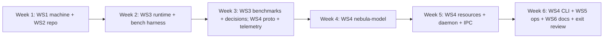

# Project Nebula — Phase 0 Implementation Plan: Foundations

| Field | Value |
| --- | --- |
| Status | Ready to start |
| Date | 2026-10-01 |
| Parent document | [NEBULA_DESIGN.md](NEBULA_DESIGN.md) (Section 12, Phase 0) |
| Builder | You, with AI assistance (Cursor) |
| Budget | ~70–85 hours ≈ **6 weeks at 12–15 h/week** |

---

## 1. Goal

By the end of Phase 0:

- The machine, the repo and the model runtime are set up properly.
- **Real measurements** from your 4070 have replaced the estimates in the design doc.
- A minimal but production-quality Nebula core exists: a daemon that supervises the model and streams chat over local IPC, logs every call with trace IDs, monitors resources, and reports its own health.

There are no agent tools yet; that is Phase 1. Phase 0 builds the ground everything else stands on, and it is built carefully because Nebula will eventually maintain this code itself.

### 1.1 In Scope

| Workstream | Summary |
| --- | --- |
| **WS1 Machine prep** | Disk space, the `C:` drive, toolchains, Tailscale SSH |
| **WS2 Repo and GitHub** | `Xydra01/Nebula`, `Nebula-dev-bot`, branch protection, secret scanning, CI |
| **WS3 Model runtime and benchmarks** | PrismML binaries, model downloads, benchmark harness, measurements, model decisions |
| **WS4 Rust core** | `nebula-proto`, `nebula-telemetry`, `nebula-model`, `nebula-resources`, `nebula-daemon`, `nebula-cli` |
| **WS5 Ops** | Encrypted backups, `nebula doctor`, the remote-access check |
| **WS6 Docs and handoff** | Measurement updates, decision records (ADRs), conventions, Phase 1 backlog |

### 1.2 Out of Scope (Phase 1+)

The tool host and MCP, shell access, permission tiers, worktrees, the agent loop, the TUI (Phase 0 uses a plain CLI), memory and indexing, web research, ntfy, the approval page, `nebula mcp`, and Cursor delegation.

---

## 2. Schedule



| Milestone | Contents | Est. hours | Target |
| --- | --- | --- | --- |
| **M0.1** Machine ready | WS1 complete | 6–8 | End of week 1 |
| **M0.2** Repo live | WS2 complete, first CI run green | 5–6 | End of week 1 |
| **M0.3** Model running | Bonsai 2 serving on the 4070; smoke test passes | 4–6 | Mid week 2 |
| **M0.4** Measured | Benchmarks done; ADR-004 (model profiles) and ADR-005 (fallback) written; design doc tables updated | 10–12 | End of week 3 |
| **M0.5** Core skeleton | `proto`, `telemetry`, `model` crates working with tests | 18–22 | End of week 4 |
| **M0.6** Daemon live | `resources`, `daemon`, IPC, `nebula chat` streaming end to end | 14–18 | End of week 5 |
| **M0.7** Phase 0 done | CLI complete, doctor, backups, SSH check, docs, exit review | 10–12 | End of week 6 |

If a week slips, **M0.4 has priority over M0.5–M0.6**. The measurements decide model profiles and context budgets that the code depends on.

---

## 3. WS1: Machine Prep

| # | Task | Done when | Est. |
| --- | --- | --- | --- |
| 1.1 | **Done (2026-10-01): `C:` retired from the boot path.** The boot loader moved to a new ESP on the NVMe and the drive is disabled in BIOS (still physically installed). See Section 3.1. | — | Done |
| 1.1a | **Done.** Page file moved to `F:\pagefile.sys`, **4096 MB initial / 12288 MB maximum**, by `scripts/phase0-ws1-admin.ps1`. **2026-10-04:** maximum raised to 32768 MB (`scripts/set-pagefile.ps1`), because llama-server's commit charge hit the ~44 GB limit (see the ops notes). | `Win32_PageFileUsage` lists only `F:\pagefile.sys`; `C:\pagefile.sys` is gone | Done |
| 1.1b | **Done.** SMART health for all three drives: the WD 240 GB SSD (`C:`), the Samsung 980 (`F:`), and the WD Blue 1 TB HDD (`D:`). All passed; the baseline is in `docs/ops/phase0-notes.md`. Windows had logged **two bad-block events on the Samsung 980 / `F:`** (2026-06-26 and 2026-08-27), and SMART shows `media_errors=2`. | Health status and key attributes (media errors, reallocated/pending sectors, % used) recorded in `docs/ops/phase0-notes.md` | Done |
| 1.2 | ~~Free 100–150 GB on `F:`~~ **Done: 105 GB freed** (113.8 GB free when checked on 2026-10-01). The disk budget is revised for this in Section 3.2. | `F:` has at least 100 GB free | Done |
| 1.3 | Create the data roots. **Hot data:** `F:\Nebula\` with `state\`, `logs\`, `models\`, `worktrees\`, `build\`. **Cold/bulk data:** `D:\NebulaCold\` with `models-archive\`, `logs-archive\`, `research\`, `backups-tmp\`, `backups-local\`, `downloads\`, `wsl\` (`D:` approved by you; if 1.1b shows it is unhealthy, fall back to the contingency in Section 10) | Folders exist | 0.1 h |
| 1.4 | Update the **NVIDIA driver** to a current Game Ready/Studio version that supports CUDA 12.4+ | `nvidia-smi` shows the driver and a CUDA version of 12.4 or later | 0.5 h |
| 1.5 | Install **Visual Studio 2022 Build Tools** with the "Desktop development with C++" workload (MSVC, Windows SDK, CMake) | `cl` and `cmake` work in a Developer PowerShell | 1 h |
| 1.6 | ~~Install the CUDA Toolkit now~~ **Install only if task 3.2 (building from source) becomes necessary.** The prebuilt binaries bundle the CUDA runtime they need, and skipping the toolkit saves ~5 GB on `F:`. | — | (0.5 h) |
| 1.7 | Install **Rust** via `rustup` (stable, MSVC host) plus `rustfmt`, `clippy`, `cargo-nextest`, `sccache`, `cargo-sweep` | `cargo nextest --version` works | 0.5 h |
| 1.8 | Install **Git**, **GitHub CLI** (`gh`), **uv**, **Node LTS**, **gitleaks**, **rclone**, **Ninja** (via `winget`) | Each one answers `--version` | 0.5 h |
| 1.9 | Enable **WSL2** (no distro needed yet; the sandbox and SearXNG distros come in Phases 2–3). Set `.wslconfig` memory to 6 GB. | `wsl --status` shows version 2 | 0.5 h |
| 1.10 | Enable **Windows OpenSSH Server**. Change the firewall rule so port 22 is reachable **only from the Tailscale range `100.64.0.0/10`**. Use key-based authentication only and disable password logins in `sshd_config`. | From the laptop on Tailscale, `ssh <desktop>` works with your key. From outside the tailnet it fails. Password login is refused. | 1–1.5 h |
| 1.11 | Set machine-wide environment variables: `SCCACHE_CACHE_SIZE=6G`, `CARGO_TARGET_DIR=F:\Nebula\build\target` (shared, so worktrees don't each create a target directory) | `cargo build` writes there | 0.2 h |
| 1.13 | Install **smartmontools**. Create an **elevated scheduled task** (monthly, plus a trigger on `disk` error events) that runs `smartctl -a -j` for each drive and writes `F:\Nebula\state\smart\<drive>-<date>.json` for `doctor` to read | First JSON files exist for all three drives | 0.5–1 h |
| 1.12 | **Create a Windows 11 installation/recovery USB** (Media Creation Tool, 8 GB+ stick) and label it. It's your repair path if the old drive, which holds the boot loader, dies. | USB boots to the Windows setup screen (test once) | 0.5 h |

**Note:** Windows lives on `F:`, so the default install locations (user profile, `Program Files`, `%TEMP%`) are already on `F:`. Every installer should still be checked so it doesn't default to `C:`. Watch the VS Build Tools "shared components" path, the WSL distro location, and any "install for all users" prompts.

### 3.1 Working Around the Old `C:` Drive

> **Status 2026-10-01: resolved.** You moved the boot loader to a new 300 MB ESP on the NVMe and disabled the old drive's SATA port in BIOS. Windows boots normally without it. The drive is still physically installed, with its old ESP intact as a fallback (re-enable the port to use it). The rules below now apply only if that port is ever re-enabled. `nebula doctor` should warn if `C:` reappears.

A read-only check on 2026-10-01 showed the old drive is more entangled than expected:

| Finding | Why it matters |
| --- | --- |
| The **EFI System partition (boot loader) is on the old 240 GB WD SSD**, not on the Samsung NVMe | The PC **boots from the failing drive**. Disconnecting it, or taking it offline, without first moving the boot loader would likely leave the PC **unable to boot**. Waiting was the right call. |
| The **page file (27 GB) was on `C:`** | Paging to a drive that loses data can cause crashes. Fixed by task 1.1a. |
| `%TEMP%` is on `F:` | Good: nothing temporary is written to `C:`. |

**Rules for Phase 0 and beyond, until `C:` is retired:**

1. **Nobody touches `C:` or its partitions.** Not Nebula, not installers, not cleanup tools. Nebula's path rules reject `C:` (Phase 1 sandbox). In Phase 0, `nebula doctor` already flags any configured path that resolves to `C:`.
2. Don't take the disk offline, format it or delete partitions from it while it holds the boot loader.
3. `nebula doctor` reports: `C:` still attached (warn), boot loader still on `C:` (warn), page file on `C:` (fail).
4. Backups matter more because the boot path depends on a failing drive. If that drive dies, Windows on `F:` is intact but won't boot until it is repaired from a USB stick. **Create a Windows installation/recovery USB now** (task 1.12) so that repair is a 15-minute job instead of an emergency.

**Retiring `C:` later (a separate, deliberate operation; not part of Phase 0):**

1. Make a full backup, and have the recovery USB ready.
2. Shrink `F:` by ~300 MB and create a new EFI System partition on the Samsung NVMe.
3. Run `bcdboot F:\Windows /s <new ESP letter> /f UEFI` to write the boot files there.
4. Set the NVMe as the first boot device in UEFI/BIOS. Boot with `C:` still attached, then confirm `bcdedit` shows the new ESP.
5. Only then disconnect the old drive.

This is documented in `docs/ops/retire-c-drive.md` during WS6, to be done when you have time for the physical work. Nebula never does this itself: it is tier 3 and hands-on.

### 3.2 Revised Disk Budget

Free space on `F:` after the cleanup: ~105 GB. A **second, larger drive is available**: `D:` is a 1 TB WD Blue hard drive with ~244 GB free. Pending the health check in task 1.1b, it takes the bulk, latency-tolerant data.

**`F:` (NVMe, hot):** Nebula target **≤ 60 GB** at steady state

| Item | Budget |
| --- | --- |
| Toolchains (VS Build Tools, Rust, uv, Node, Git, misc.); CUDA toolkit skipped | ~18 GB |
| Page file moved from `C:` (4–32 GB) | ~10 GB typical, 32 GB worst case |
| Active models: Bonsai PTQ1_0 + mmproj + KV bias, Bonsai PQ2_0 + MTP head (ADR-006), Gemma 4 fallback, embedding model | ~33 GB |
| Rust build output (shared target, `sccache` capped at 6 GB) | ~10 GB |
| Worktrees, package caches, state DB | ~8 GB |
| Hot logs (last 7 days) | ~2 GB |
| **Total** | **~62 GB** → leaves **~40 GB free** |

**`D:` (HDD, cold):** ~60 GB used of 244 GB free

| Item | Budget |
| --- | --- |
| Model archive: benchmark candidates not in active use, kept so they never need re-downloading | ~20 GB |
| Log archive (older than 7 days) and blob store overflow | ~8 GB |
| Research cache (Phase 3) | ~10 GB |
| Backup staging (compressed snapshots before upload) | ~5 GB |
| WSL2 SearXNG distro (Phase 3; speed doesn't matter much) | ~5 GB |
| Headroom | rest |

The WSL2 **sandbox** distro (Phase 2) goes on `F:` because builds inside it need SSD speed; that is ~8 GB, decided when Phase 2 starts. Active models stay on `F:` because loading a 6 GB model from the HDD takes ~40 s against ~3 s from the NVMe, which matters for game-mode resume.

**Revised disk-guard thresholds for `F:`** (smaller drive margin):

- **Below 30 GB free:** warn and clean up
- **Below 20 GB free:** block new work
- **Below 12 GB free:** pause tasks

`D:` gets its own thresholds: warn below 50 GB, block archive writes below 25 GB.

**Rules for `D:` (approved 2026-10-01):**

- Nebula reads and writes only inside `D:\NebulaCold\`. Everything else on `D:` is your data, and Nebula never deletes it.
- **Big deletes need your approval**: more than 1 GB or 500 files in one operation, any model file, or anything outside Nebula's own folders. Routine retention is grouped into one summary approval.
- In Phase 0 this rule applies to *you and the scripts*: the retention code in `nebula backup` and any model cleanup must ask (CLI prompt) before any delete above the threshold. The log archive's 8 GB cap is the one exception: it prunes the oldest days automatically (decided 2026-10-04). Phase 1 turns it into an enforced sandbox rule.

**Living with the aging Samsung 980 (`F:`) for ~1 more year:**

- **Downloads land on `D:\NebulaCold\downloads\` first.** Only the verified final model file is moved to `F:`, which avoids partial-download churn on the NVMe.
- Old log blobs and benchmark raw data go to `D:`. `sccache` is capped at 6 GB; `cargo sweep` runs weekly.
- Monthly SMART tracking (task 1.13). `doctor` alerts on rising media errors or available spare falling below its threshold.
- State backups every 6 hours (Section 7.1), with a local copy on `D:`.
- `docs/ops/replace-nvme.md` (WS6) makes a future swap a planned job.

**Phase 0 peak:** benchmark the fallback candidates **one at a time**. Download, benchmark, then move to `D:\NebulaCold\models-archive\` before downloading the next. Do the same for PQ2_0. Peak extra use on `F:` stays under ~8 GB.

---

## 4. WS2: Repo and GitHub

| # | Task | Done when | Est. |
| --- | --- | --- | --- |
| 2.0 | **Status 2026-10-01:** 2.1 and 2.2 are done: [github.com/Xydra01/Nebula](https://github.com/Xydra01/Nebula), with the `Project Neutron` folder itself as the repo. The GitHub half of 2.5 (secret scanning + push protection) is on. **2026-10-02:** 2.3 done: `Nebula-dev-bot` opened and you merged [PR #1](https://github.com/Xydra01/Nebula/pull/1). 2.4 done, except for the required status check, which comes with 2.7: ruleset `protect-main` (PR required, 1 code-owner approval after the last push, no force-push, no deletion, repository-admin bypass via PR only, verified by a rejected direct push). 2.5, 2.6 and 2.8 are done in the `feat/ws2-repo-hygiene` PR. **2026-10-04:** 2.7 CI added (`.github/workflows/ci.yml`): gitleaks on the full history, ruff + pytest for `bench/`, and the Rust checks, which are skipped until a `Cargo.toml` exists. The required check for the ruleset is the aggregate job **CI ok**, added to `protect-main` after [PR #12](https://github.com/Xydra01/Nebula/pull/12) merged (GitHub Actions only, branches need not be up to date), which completes 2.4. Workflow files can't be pushed by the bot (its token has no `workflow` scope, by design); they are pushed over SSH as Xydra01 and merged with the admin bypass. | — | — |
| 2.1 | Create the **public** repo `Xydra01/Nebula` with an MIT `LICENSE`, `README.md` (vision paragraph + status) and a Rust/Python `.gitignore` | Repo exists | 0.3 h |
| 2.2 | **First commit**: move `docs/NEBULA_DESIGN.md` and `docs/PHASE0_PLAN.md` from the `Project Neutron` folder into the repo | Docs visible on GitHub | 0.2 h |
| 2.3 | Create the **`Nebula-dev-bot` machine account** (separate email, 2FA). Invite it as a collaborator with write access. Create a **classic token with only the `public_repo` scope**, with a 90-day expiry. Fine-grained tokens can't access repos the account only collaborates on ([github/roadmap#601](https://github.com/github/roadmap/issues/601)). Because the bot is a collaborator only on repos you invite it to, that is still the limit of its write access. Store the token with `scripts/store-bot-token.ps1`, which saves it in Windows Credential Manager as `nebula/github_bot_token`. **Status 2026-10-02:** account created; invited with write access. | The bot can push a test branch and open a PR | 0.5–1 h |
| 2.4 | Add `CODEOWNERS` (`* @Xydra01`). Set up branch protection / a ruleset on `main`: PR required, 1 approval from a code owner, required status checks (the CI job from 2.7), no force-push, no deletion | A direct push to `main` is rejected; a bot PR needs your approval | 0.5 h |
| 2.5 | Turn on **GitHub secret scanning + push protection** (free for public repos). Add `gitleaks` as **pre-commit and pre-push hooks** (a `scripts/install-hooks.ps1` that sets `core.hooksPath` to `.githooks/`) | A commit containing a fake token is blocked locally, and the same push is blocked by GitHub | 0.5 h |
| 2.6 | Write `CONTRIBUTING.md` covering: branch naming (`nebula/<task-id>-<slug>`, `feat/...` for your own work); **commit trailers** (`Co-authored-by: Nebula-dev-bot <336789866+Nebula-dev-bot@users.noreply.github.com>`, `Nebula-Task: <id>`); Conventional Commits style messages; how to run checks locally | File merged | 0.5 h |
| 2.7 | **CI (GitHub Actions)** on the Windows runner: `cargo fmt --check`, `cargo clippy -D warnings`, `cargo nextest run` (CPU-only tests), `gitleaks detect`, plus `ruff` + `pytest` for `bench/`. Cache with `Swatinem/rust-cache`. | First PR shows a green required check | 1.5–2 h |
| 2.8 | Add issue templates (bug, feature, ADR) and a `docs/adr/` folder with `ADR-001`–`003` copied from the design doc | Templates show on GitHub | 0.5 h |

**GPU tests in CI:** GitHub-hosted runners have no GPU. Tests that need the real model or NVML are marked `#[ignore]` with a `gpu` tag and run locally with `cargo nextest run --run-ignored all`. A self-hosted runner on your PC is deliberately avoided: it would let a public repo's workflows run code on your machine.

---

## 5. WS3: Model Runtime and Benchmarks

### 5.1 Runtime Setup

> **Status 2026-10-02:**
> - **3.1 done:** `prism-b10743-adfffbe`, CUDA 12.4, pinned in `config/runtime.lock.toml`.
> - **3.3 done:** PTQ1_0, PQ2_0 and mmproj Q8_0 downloaded, with hashes verified and recorded in `config/models.lock.toml`. There is **no Bonsai 2 drafter** to download.
> - **3.6 done:** all smoke checks pass ([bench/results](../bench/results/)). With 32K context and an f16 KV cache, the model plus context uses 7.9 GB, total VRAM use is 9.3 GB (the desktop takes 1.4 GB), and generation runs at 30–50 tokens/s.
> - **3.4 done:** stock llama.cpp `b11342` plus six fallback candidates in two rounds (9B dense: Ornith 1.0, Ornith 1.5, DeltaCoder; MoE with experts in RAM: Qwen3.6-35B-A3B, Gemma 4 26B-A4B, GLM-4.7-Flash). **Gemma 4 26B-A4B won** (ADR-005); the others are archived on `D:`.
> - **3.7 done:** KV bias files generated for PTQ1_0 and PQ2_0; the server loads them with q4_0 KV.
> - **5.2 harness and B1–B3, B5–B8 run** (overnight, 2026-10-02). See the [report](../bench/results/2026-10-02/report.md), [ADR-004](adr/ADR-004-model-profiles.md) and [ADR-005](adr/ADR-005-fallback-model.md) (both Accepted 2026-10-02).
> - **B4 done (2026-10-03):** MTP speculative decoding with the ProCreations head. See the [B4 report](../bench/results/2026-10-03/report.md) and [ADR-006](adr/ADR-006-mtp-speculative-decoding.md) (Accepted 2026-10-04).
> - **3.5 done (2026-10-04):** Qwen3-Embedding-0.6B Q8_0 on the CPU (stock llama.cpp, `--embedding --pooling last --device none`). 1.2–1.8 GB of RAM with 1024-token inputs, ~250 tokens/s, no VRAM, and 1–3% slower `standard` generation while it indexes. See the [report](../bench/results/2026-10-04/report.md).

| # | Task | Done when | Est. |
| --- | --- | --- | --- |
| 3.1 | Download the **PrismML llama.cpp release** for **Windows x64 CUDA 12.4** (from the `PrismML-Eng/llama.cpp` releases, or via the Bonsai-demo `setup.ps1`). Unpack to `F:\Nebula\runtime\llama-prism\<version>\`, recording the version and commit in `runtime.lock.toml`. | `llama-server --version` prints the fork's version | 0.5 h |
| 3.2 | **Fallback path:** if the prebuilt binaries fail, build the `prism` branch with `-DGGML_CUDA=ON` using the Bonsai-demo `scripts/build_cuda_windows.ps1` | Only needed if 3.1 fails | (2–4 h) |
| 3.3 | Download into `F:\Nebula\models\` from `prism-ml/Ternary-Bonsai-2-27B-gguf`: **PTQ1_0** (5.95 GB), **PQ2_0** (7.21 GB, for comparison only; moved to `D:\NebulaCold\models-archive\` once benchmarked unless chosen), the **dspark drafter**, and the **mmproj** (Q8_0). Record SHA-256 hashes in `models.lock.toml`. | Files present, hashes recorded | 0.5 h (+ download time) |
| 3.4 | Download the fallback candidates **one at a time**, to keep `F:` within budget: `deepreinforce-ai/Ornith-1.0-9B-GGUF` **Q6_K**, benchmark it, move it to the archive on `D:`; then `danielcherubini/Qwen3.5-DeltaCoder-9B-GGUF` **Q6_K**. The winner (ADR-005) moves back to `F:`. Get a stock (upstream) llama.cpp CUDA release for them. | Both benchmarked; only the winner is on `F:` | 0.5 h |
| 3.5 | Download a small **embedding model** GGUF (~0.6B class) for CPU embedding; Phase 2 uses it, and downloading it now completes the disk budget picture | It loads with `llama-server --embedding` on the CPU | 0.3 h |
| 3.6 | **Smoke test**: run PTQ1_0 with `-ngl 99 -fa on -c 32768`. Check that chat answers sensibly, `tool_calls` work, the `json_schema` response format is honored, and the server log shows all layers offloaded | Smoke checklist passes; the launch command is saved in `bench/profiles/standard.toml` | 1–2 h |
| 3.7 | Generate the **4-bit KV calibration bias** (`llama-kv-mean-center`), using a calibration corpus of mixed code and prose. Phase 0 can use the built-in corpus; re-run later with a Nebula-specific one. | `*-kv-bias.gguf` exists and the server picks it up with q4_0 KV | 0.5 h |

### 5.2 Benchmark Harness (`bench/`, Python)

A small `uv` project in the repo. It is the seed of the Phase 1+ eval harness, so it is written cleanly.

```
bench/
  pyproject.toml
  profiles/            # one TOML per server profile (flags, model, KV type, context)
  prompts/
    coding/            # ~20 hand-picked coding prompts with reference checks
    tool_calls/        # 100 tool-call cases with JSON schemas and expected calls
    long_context/      # synthetic repo dumps at 8K/32K/64K/128K tokens
  nebula_bench/
    server.py          # start/stop llama-server for a profile, wait for health
    perf.py            # throughput, VRAM, cache-hit measurements
    quality.py         # run coding prompts, score them
    toolcalls.py       # tool-call / JSON reliability
    report.py          # writes results/<date>/report.md + raw JSON
  results/             # committed reports (small); raw logs are gitignored
```

**Benchmark matrix**

| ID | What | Method | Output |
| --- | --- | --- | --- |
| B1 | **Throughput** | Prompt processing and generation tokens/s at 8K / 32K / 64K / 128K, for FP16 and q4_0 KV. Use `llama-bench` where it supports the fork's formats, otherwise time server requests (`timings` field). 3 runs each, report the median. | Table: context × KV → pp t/s, tg t/s |
| B2 | **VRAM** | Peak dedicated GPU memory per configuration (NVML total used minus the idle baseline), plus a check for **shared-memory spill** (Task Manager / Windows performance counters) | Table that replaces design doc Section 2.3 |
| B3 | **Prompt cache** | Use `--ctx-checkpoints 32 --cache-ram 4096 --cache-idle-slots` with `cache_prompt: true`. Send a 20K-token prefix plus a varying suffix 10 times and compare `timings.prompt_n` / `prompt_ms` against `cache_prompt: false`. Repeat with the tool list reordered to confirm prefix sensitivity. | Cache speedup factor; rules for prompt layout |
| B4 | **Burst profile.** ~~Blocked (2026-10-02): PrismML has not released a dspark drafter for Bonsai 2 27B.~~ **Done (2026-10-03)** with the community MTP head instead: PQ2_0 + MTP is 1.58x faster; PTQ1_0 + the same head only 1.09x. See the [B4 report](../bench/results/2026-10-03/report.md) and [ADR-006](adr/ADR-006-mtp-speculative-decoding.md) (Accepted 2026-10-04). | dspark drafter, `-np 1`, generating 2K tokens of code. Measure the speedup and the first-token penalty against `standard`. | Speedup and when `burst` is worth using |
| B5 | **Quality** | The 20 coding prompts (mix: Python, Rust, TS, C++; algorithms, bug fixes, small refactors; some taken from Smart Archive code) on PTQ1_0, PQ2_0, Ornith Q6_K and DeltaCoder Q6_K. Scored by **executable tests** where possible, otherwise by a rubric you grade blind (model names hidden). | Pass rate per model |
| B6 | **Tool-call reliability** | 100 tool-call cases (pick the right tool, valid arguments, multi-tool turns) with and without `json_schema` / grammar constraints | % valid, % correct tool, % correct arguments |
| B7 | **Long-context sanity** | Needle-in-a-repo retrieval at 32K / 64K / 128K (q4_0 + bias versus without bias) | Accuracy per length; whether 128K is usable in practice |
| B8 | **Game-mode cost** | Time to unload the model and reload it from NVMe (cold and warm) | Seconds; tunes the game-mode resume cooldown |

**Decisions this produces**

- **ADR-004, Model profiles:**
  - PTQ1_0 versus PQ2_0 as the default
  - the default context size and KV type
  - whether 128K is a real profile
  - when `burst` is used
  - final llama-server flags for each profile
- **ADR-005, Fallback model:** Ornith versus DeltaCoder. The losing model and PQ2_0 (if it isn't chosen) are deleted to recover disk space.
- **Prompt layout rules** for Section 5.5 of the design doc, from B3.

Est. 10–12 h for the harness, the runs and the write-up (runs can happen unattended overnight).

---

## 6. WS4: Rust Core

### 6.1 Workspace Layout (Phase 0 subset)

```
Cargo.toml                 # workspace; shared lints (clippy pedantic subset), edition 2024
rust-toolchain.toml        # pinned stable version
crates/
  nebula-proto/            # IPC + event types, JSON-RPC envelopes, protocol version
  nebula-telemetry/        # tracing setup, JSONL writer, trace IDs, blob store, redaction
  nebula-config/           # typed config: embedded default.toml + local override (added in WS4)
  nebula-model/            # ModelBackend trait, llama-server backend + supervisor, profiles
  nebula-resources/        # GPU/CPU/RAM/disk sampling, disk guard, drive checks
  nebula-daemon/           # binary: service, named pipe server, event bus
  nebula-cli/              # binary: `nebula`
config/
  default.toml             # shipped defaults (data root, profiles, thresholds)
```

`nebula-tools`, `nebula-sandbox`, `nebula-orchestrator` and `nebula-memory` are **not** created yet. Empty crates rot; they are added in the phase that needs them.

**Shared conventions** (written into `CONTRIBUTING.md`)

- Errors: `thiserror` in libraries, `anyhow` only in the two binaries.
- No `unwrap()`/`expect()` outside tests, enforced by clippy (`unwrap_used`, `expect_used`).
- Every public function that does I/O gets a `tracing` span.
- Config is read once into typed structs (`serde`). Unknown keys are an error, so typos don't silently fail.
- Small modules, doc comments on public items.

### 6.2 `nebula-proto` (2–3 h)

- **Transport framing:** JSON-RPC 2.0 messages, **newline-delimited JSON** over the named pipe. Simple to debug, and good enough for local IPC.
- **Types:**
  - `Request` / `Response` / `Notification` envelopes with `proto_version: u32`
  - Methods for Phase 0: `daemon.status`, `daemon.shutdown`, `chat.start`, `chat.cancel`, `model.status`, `model.set_profile`, `resources.snapshot`, `logs.subscribe`, `doctor.run`
  - Events: `chat.token`, `chat.done`, `chat.error`, `model.state_changed`, `resources.snapshot`, `log.event`
- **IDs:** `TraceId` / `SpanId` newtypes (ULIDs, so they sort by time).
- **Tests:** serde round-trip tests for every message, plus a **golden JSON fixture** per message (`insta` snapshots) so protocol changes are always visible in diffs.

### 6.3 `nebula-telemetry` (5–6 h)

- `init(config) -> Telemetry` sets up `tracing-subscriber` with one layer that builds a redacted `LogEvent` and sends it to:
  - a **JSONL file**, rotated daily (UTC dates) to `F:\Nebula\logs\nebula-YYYY-MM-DD.jsonl`. A small built-in writer replaces `tracing-appender`, whose file names can't take this form; it flushes every line.
  - the console (stderr) for the CLI and dev use. The console line is built from the redacted event, so secrets never reach the terminal either.
  - an in-process **broadcast channel** that feeds `logs.subscribe` (for `nebula logs tail`)
- Every event carries `trace_id`, `span_id`, `parent_span_id`, `task_id`/`step_id` when present, `target`, `level` and `event`.
- **Blob store:** `put(bytes) -> BlobRef` writes zstd-compressed, content-addressed files to `logs\blobs\ab\cdef...zst` (SHA-256), with deduplication. Log events reference large payloads such as prompts, outputs and stderr by `BlobRef`.
- **Redaction filter (v0):** masks the values of registered secrets and common token patterns (GitHub `ghp_`/`gho_`/`ghs_`…/`github_pat_`, `cursor_` keys, generic `Bearer` tokens) before writing. Secrets are registered through `Telemetry::redactor().register(value)`. The daemon loads them from Credential Manager, so the telemetry crate needs no `unsafe` Windows calls.
- **Disk accounting:** reports log + blob size to `nebula-resources` and enforces the log budget: hot logs (last 7 days, ~2 GB) stay on `F:`, and older days are moved to `D:\NebulaCold\logs-archive\`. `enforce_archive_cap` deletes the archive's oldest days beyond 8 GB without asking. The archive is exempt from the big-delete rule, but only for daily log files, and the newest day is always kept. Every other prune goes through `execute_prune`, which refuses plans above 1 GB / 500 files without approval at a prompt.
- **Tests:** an event written produces valid JSONL with the IDs; blob deduplication; redaction masks a planted token in both the event fields and the blob content.

### 6.4 `nebula-model` (10–12 h): the largest piece

**Trait (sketch)**

```rust
#[async_trait]
pub trait ModelBackend: Send + Sync {
    async fn chat(&self, req: ChatRequest) -> Result<ChatStream, ModelError>;
    async fn embed(&self, input: Vec<String>) -> Result<Vec<Vec<f32>>, ModelError>;
    async fn tokenize(&self, text: &str) -> Result<Vec<u32>, ModelError>;
    async fn health(&self) -> Result<BackendHealth, ModelError>;
}
```

`ChatRequest` contains messages, tools, an optional `response_schema` (JSON Schema), sampling settings, `cache_prompt` (always true), `max_tokens` and `trace_id`. `ChatStream` yields `Token`, `ToolCall`, `Usage` (prompt_n, prompt_ms, predicted_n, predicted_ms) and `Done`.

**`LlamaServerBackend`**

- Talks to llama-server's OpenAI-compatible `/v1/chat/completions` with SSE streaming through `reqwest` and `eventsource-stream`.
- Also uses `/health`, `/slots`, `/metrics` and `/tokenize`.
- Records `timings` from each response into a `model.call` log event. The full prompt and output go to the blob store.

**Supervisor**

- Launches llama-server with **profile-specific flags** (from `config/default.toml`, values fixed by ADR-004) on `127.0.0.1` and a free port, inside a **Windows Job Object** (`windows` crate). The Job Object kills the child if the daemon dies, so there are never orphaned servers holding VRAM.
- Captures stdout/stderr into a rolling buffer and the blob store.
- **Health loop:** polls `/health` every 2 s. If the server crashes or stops responding, it restarts with exponential backoff (1 s, 2 s, 4 s, up to 60 s). After 5 failures in 10 minutes it enters a `Failed` state, which is reported by `doctor`.
- **Profile switch:** drain in-flight requests (or cancel them after a timeout), stop the server, start it with the new flags, then report a `model.state_changed` event.
- **States:** `Stopped`, `Starting`, `Ready`, `Busy`, `Restarting`, `Failed`, `Unloaded` (for game mode in Phase 1).

**Profiles (config)**

```toml
[model.profiles.standard]
runtime   = "llama-prism"
model     = "Ternary-Bonsai-2-27B-PTQ1_0.gguf"
ctx       = 32768
kv_type   = "f16"
flags     = ["-ngl", "99", "-fa", "on", "-np", "1",
             "--ctx-checkpoints", "32", "--cache-ram", "4096", "--cache-idle-slots"]
# final values come from ADR-004
```

**Tests**

- A **fake llama-server** (a small `axum` app in `tests/`) that streams canned SSE, can be told to crash or hang, and records the requests it receives. This covers the streaming parser, tool-call parsing, restart/backoff and profile switching, all CPU-only in CI.
- GPU-gated integration tests against the real server: chat, `json_schema`, tool call, and the restart-after-kill test.

**As built (WS4):**
- The supervisor starts servers through a `Launcher` trait. `ProcessLauncher` is the real one (Job Object, `CREATE_NO_WINDOW`, stdout/stderr ring buffer). The tests use a launcher that runs the fake server in-process, so crash, hang and switch tests need no extra binary.
- `ModelManager::pid()` exposes the server PID for per-process GPU/RAM accounting in `nebula-resources`.
- The chat model and the CPU embedding server are two `ModelManager`s. `config/default.toml` has the `standard`, `long`, `lean` and `embedding` profiles. `vision` waits until `--mmproj` is benchmarked.
- `LLAMA_API_KEY` is 32 random bytes per launch, passed by environment.
- GPU tests: `standard` chat plus restart-after-kill, and the embedding server (`cargo nextest run -p nebula-model --run-ignored only`). The `json_schema` and tool-call GPU tests come with the daemon's chat path.
- `ModelManager::spawn_with` takes an optional `Preflight` hook that runs before every launch. If it refuses, the server stays `Stopped` (not `Failed`) and callers get `ModelError::Preflight`. `nebula-resources` supplies the commit-charge check.
- Not yet done: ADR-006's automatic `--spec-type none` fallback.

### 6.5 `nebula-resources` (5–6 h)

- **GPU:** `nvml-wrapper` for total/used/free VRAM, utilization, temperature, clocks and power.
  - **Known Windows issue:** under the WDDM driver model, NVML often returns *not available* for **per-process GPU memory**.
  - **Fallback:** read the Windows performance counters `\GPU Process Memory(*)\Dedicated Usage` via the PDH API (`windows` crate) and map process IDs to names with `sysinfo`.
  - Verify in week 5 which source works on your machine.
- **CPU/RAM/processes:** `sysinfo`.
- **Disk:** free space on `F:` with the **disk guard** thresholds (warn below 30 GB, block new work below 20 GB, pause below 12 GB), and on `D:` (warn below 50 GB, block archive writes below 25 GB). In Phase 0 these are reported only; enforcement arrives with tasks in Phase 1.
- **Drive checks:**
  - whether the failing `C:` volume is still attached
  - whether the EFI System partition is still on that disk
  - whether a page file is on it (via `Win32_PageFileUsage`)
  - new disk error events in the System log (`disk` events 7/51/153, `Ntfs` errors) per drive since the last check, which watches `F:`'s bad-block history

  All are reported to `doctor`. The path ban itself is Phase 1 (sandbox).
- Publishes a `ResourceSnapshot` every 2 s on the daemon event bus and writes one sample per 30 s to the logs.
- **Tests:** snapshot serialization, threshold logic with fake disk values, PDH/NVML adapters behind a trait with fakes.

**As built (WS4):**
- **Config:** `nebula-config` holds the typed config. `config/default.toml` is embedded in the binaries, and `F:\Nebula\config\nebula.toml` (or `$NEBULA_CONFIG`) is merged over it. Validation rejects any configured path on the retired drive.
- **Per-process VRAM:** on this machine NVML lists the GPU processes but reports no amounts (WDDM), so the PDH counters are what work. The sampler uses NVML amounts when it gets them, otherwise PDH, and logs which source it used.
- **Commit-charge preflight:** a load is refused when `commit_estimate_mib` (per profile) plus `resources.commit_margin_mib` doesn't fit. Commit is read fresh at launch. The limit counts page-file growth (physical RAM plus the page-file maximums in the registry), because Windows grows the page file on demand.
- **Doctor:** `doctor::local_checks` runs without the daemon. System facts come from one PowerShell run; the firewall goes through `HNetCfg.FwPolicy2`, because `Get-NetFirewallPortFilter` needs admin rights when it enumerates and takes ~20 s otherwise. `state\doctor.json` holds the end of the last disk-event window. SMART reads the newest batch in `state\smart\` and compares each device with its previous snapshot.

### 6.6 `nebula-daemon` (6–8 h)

- **Single instance:** a named mutex `Global\NebulaDaemon`. A second launch exits with a clear message.
- **Named pipe server** at `\\.\pipe\nebula` using `tokio::net::windows::named_pipe`, with an ACL restricted to the current user (security descriptor via the `windows` crate). Multiple simultaneous clients are supported: each connection gets a task that reads requests and forwards subscribed events.
- **Event bus:** `tokio::sync::broadcast` for events, `mpsc` for commands into the subsystems.
- **Startup order:** config → telemetry → resources → model supervisor (loads the `standard` profile) → pipe server → `daemon.ready` log.
- **Shutdown:** `daemon.shutdown` request or Ctrl-C. Stop accepting clients, cancel chats, stop the model, flush logs.
- **Startup mode for Phase 0:** started manually (`nebula daemon start` spawns it detached). Auto-start at login (Task Scheduler) is postponed to Phase 1, once it has proven stable.
- **Tests:** the pipe protocol over a test pipe name with the fake model backend; two concurrent clients; a client disconnecting mid-stream doesn't crash the daemon.

**As built (WS4):**
- **Structure:** `nebula_daemon::start(config, Deps)` brings the daemon up and `run` adds the wait for `daemon.shutdown` or Ctrl-C. `Deps` injects the launcher, resource sources, preflight, supervisor policy, instance-mutex name and local doctor checks, so the tests run the whole daemon in-process with the fake llama-server (`nebula_model::testing`, feature `test-support`). `main.rs` wires the real ones.
- **Pipe security:** the DACL is `D:P(A;;GA;;;<current user SID>)`, which is protected, current user only, and excludes even administrators. Remote clients are rejected. The first instance is created with `first_pipe_instance`, so a second daemon fails even under a different mutex name.
- **Startup:** the chat model (`load_on_start`) and the embedding server load in the background after the pipe is up, so `daemon.status` answers during the load. `nebula daemon start` waits for `Ready`. Secrets are read from Credential Manager by `main.rs` (`[daemon] secrets`) and registered before anything else is logged.
- **Chats:** `chat.start` replies with `ChatStarted` before the first token. If the model isn't on the requested profile (or isn't ready), the chat switches or loads it first. The default `max_tokens` is 4096. A chat is cancelled by `chat.cancel`, by its client disconnecting, or by shutdown, and it ends with `chat.error` code `CANCELLED`.
- **Doctor:** `doctor.run` adds `model.chat` and `model.embedding` state, `runtime.<name>` (`--version` against `config/runtime.lock.toml`) and `model.hash.<profile>` (against `config/models.lock.toml`). Hashes are cached in `state\model-hashes.json` by path, size and mtime; the first run hashes the files (~8 GB).
- **Log maintenance:** `main.rs` archives daily logs older than 7 days and enforces the archive cap at startup and every 6 hours.

### 6.7 `nebula-cli` (4–5 h)

| Command | Behavior |
| --- | --- |
| `nebula daemon start\|stop\|status` | Start detached, stop gracefully, show state, uptime, model state and profile |
| `nebula chat [--profile p] [--schema file.json]` | Interactive chat that streams tokens; shows prompt/predicted token counts and t/s after each reply; `--schema` tests structured output |
| `nebula model status\|profile <name>` | Show or switch the model profile |
| `nebula logs tail [--level l] [--trace id]` | Live, filtered log stream from the daemon |
| `nebula doctor` | Health report (Section 7.2) with exit code 0/1/2 for ok/warn/fail |
| `nebula backup now\|list\|restore <id>` | Section 7.1 |
| `nebula resources` | One-shot resource snapshot, including top GPU memory users |

All output works in a plain SSH session: no mouse, colors that degrade cleanly, and `--json` on every command for scripting (and for Nebula itself, later).

**As built (WS4):**
- **Structure:** the commands live in the `nebula_cli` library (`run(command, ctx, input, out)`), so the end-to-end test drives them against an in-process daemon with the fake llama-server. Output formatting is pure functions, snapshot-tested with `insta`. Colors appear only when stdout is a terminal and `NO_COLOR` is unset.
- **`daemon start`:** spawns `nebula-daemon.exe` from next to `nebula.exe`, detached and outside the console's job when Windows allows it, so it survives the terminal or SSH session closing. It then waits (up to 5 minutes) until the `load_on_start` profile is ready, printing each state change. If a daemon is already running, it shows its status instead.
- **`chat`:** one line per message. The history is kept by the CLI and sent whole on each turn. `/reset` clears it and `/exit` quits. Reasoning is shown dimmed only in an interactive terminal. Ctrl-C during a reply cancels it; Ctrl-C at the prompt quits. With `--json`, one object per turn: `chat_id`, `text`, `reasoning`, `stop_reason`, `usage`. `--reasoning` and `--max-tokens` are also available.
- **`doctor`:** prepends a `daemon` check. When the daemon is down, it runs the local checks itself and reports `daemon` as FAIL. `resources` also falls back to a local snapshot.
- **`backup`:** added with WS5 (Section 7.1).
- **Install:** `scripts/install-nebula.ps1` builds release binaries and copies both to `F:\Nebula\bin\` (see `docs/ops/setup.md`).

---

## 7. WS5: Ops

### 7.1 Backups (3–4 h)

1. Configure rclone: a `gdrive` remote (Google Drive), then a **`gdrive-crypt`** remote layered on it (rclone `crypt`, standard filename encryption) pointing at `gdrive:NebulaBackups`. Save the rclone config passphrase in Credential Manager as `nebula/rclone_config_pass`. **Write the crypt passwords down offline**; without them the backups can't be restored.
2. `nebula backup now`:
   - SQLite `VACUUM INTO` a temp snapshot of `state\nebula.db` in `D:\NebulaCold\backups-tmp\` (in Phase 0 this DB holds little more than daemon metadata, but the pipeline is proven now)
   - plus `config\`, the SMART history (`state\smart\`) and, later, knowledge notes
   - pack into a `tar.zst`, keep a copy in `D:\NebulaCold\backups-local\` (last 7 days), then `rclone copy` it to `gdrive-crypt:`
   - apply retention: last 8 six-hourly, 14 daily, 8 weekly, 6 monthly. Retention deletes are small and are covered by a one-time approval of this retention policy.
3. `nebula backup restore <id>` restores into a **scratch directory** by default. Overwriting live state requires `--in-place` and the daemon to be stopped.
4. Schedule runs with **Task Scheduler** **every 6 hours** (00:00, 06:00, 12:00, 18:00) plus the 03:00 nightly, running whether or not you're logged in. The 6-hour runs are skipped if nothing has changed since the last snapshot.
5. **Test restore** once by hand, and record it in `docs/ops/backup.md`.

**As built (WS5 backups):** see `docs/ops/backup.md` for setup, renewal and restore.
- **Code:** the `nebula-backup` crate (archive, retention, rclone wrapper) and the `nebula backup now|list|restore|reauth` commands.
- **Contents:** each backup holds `state\` and `config\` as one `tar.zst`, with a SHA-256 manifest as its first entry. A restore checks every file against the manifest.
- **Database:** there is no `nebula.db` yet, so the `VACUUM INTO` step comes with the Phase 1 database.
- **Google sign-in:** the app stays unpublished, because publishing needs a verified domain. Google ends its sign-in after 7 days. `doctor` has a `backup.auth` check that warns 2 days before expiry; renew with `nebula backup reauth`.
- **Large deletes:** a scheduled run can't prompt, so retention refuses any pass above 500 files or 1 GB. It records the error, which doctor shows as WARN, and waits for `nebula backup now --allow-large-delete`.
- **Schedule:** registered by `scripts/register-backup-tasks.ps1`. Test restore from the cloud passed on 2026-10-04.

### 7.2 `nebula doctor` (2 h)

| Check | Pass / Warn / Fail |
| --- | --- |
| Daemon reachable, protocol version matches the CLI | Fail if not |
| Model supervisor state and active profile; last restart time | Fail if `Failed` |
| llama-server version matches `runtime.lock.toml`; model hash matches `models.lock.toml` | Warn if not |
| GPU visible, driver version, VRAM headroom | Warn if under 1 GB headroom |
| `F:` free space against the disk-guard thresholds | Warn below 30 GB; fail below 20 GB |
| `D:` free space | Warn below 50 GB |
| Failing `C:` drive still attached / boot loader still on it | Warn (with a pointer to `docs/ops/retire-c-drive.md`) |
| Page file on `C:` | Fail |
| Any configured Nebula path resolving to `C:` | Fail |
| New disk error events (bad blocks, I/O errors) on any drive since the last run | Warn; fail if on `F:` and more than 1 new event |
| SMART trend from task 1.13: media errors, available spare, percentage used, temperature | Warn if media errors rose since the last reading or SMART data is older than 35 days; fail if available spare is below its threshold |
| Log size against budget; log directory writable | Warn |
| Last successful backup | Warn if older than 36 h; fail if none |
| WSL2 available | Warn if not |
| OpenSSH bound to Tailscale only (inspects the firewall rule) | Warn if exposed more widely |

### 7.3 Remote Access Check (0.5 h)

From the laptop over Tailscale: `ssh desktop`, then `nebula daemon status`, `nebula chat`, `nebula logs tail`, `nebula doctor`. Confirm the named pipe is reachable from the SSH session (same user account) and that streaming output renders correctly.

---

## 8. WS6: Docs and Handoff (3–4 h)

1. **Update [NEBULA_DESIGN.md](NEBULA_DESIGN.md):**
   - Section 2.3: replace the estimates with B1/B2/B7 measurements
   - Section 2.6: final profile table from ADR-004
   - Section 5.5: prompt-layout rules from B3
   - Section 2.2: the PTQ1_0 versus PQ2_0 verdict
2. **ADRs merged:** ADR-004 (model profiles), ADR-005 (fallback model), and **ADR-007 (IPC framing: NDJSON JSON-RPC over the named pipe)**. It was planned as ADR-006, but that number went to MTP speculative decoding.
3. `docs/ops/`: `setup.md` (a reproducible machine setup checklist, which future Nebula will read), `backup.md`, `runtime-upgrade.md` (how to move to a new fork release and re-run benchmarks), `retire-c-drive.md` (the step-by-step boot-loader move and disconnect procedure from Section 3.1), and `replace-nvme.md` (moving Windows + Nebula to a new NVMe: clone or reinstall, restore the latest backup, update `config.toml` paths, move the boot loader).
4. **Phase 1 backlog** as GitHub issues, each with acceptance criteria. Seed list: MCP tool host, built-in fs/git/shell tools, permission tiers and classifier, worktrees, Job Objects for tools, TUI, executor loop, Python/Rust adapters, circuit breakers, game mode, `Nebula-dev-bot` PR flow, ntfy, auto-start.
5. **Exit review** (Section 9): go through the checklist and tag `v0.0.1-phase0`.

---

## 9. Exit Criteria

Phase 0 is done when **every** box is checked:

**Environment**
- [x] Page file moved off `C:`; nothing Nebula-related lives on `C:`; the recovery USB is made and tested
- [x] SMART health recorded for all three drives; `D:` cleared for cold data (or the plan adjusted if it isn't healthy)
- [x] `F:` stays within the revised budget (≤ 60 GB Nebula use, at least 30 GB free)
- [x] Every toolchain answers `--version`; `docs/ops/setup.md` reproduces the setup
- [x] SSH works from the laptop over Tailscale with key authentication only, and is unreachable from outside the tailnet

**Repo**
- [x] `Xydra01/Nebula` is public under MIT; `main` is protected (PR, 1 code-owner approval, required CI)
- [x] `Nebula-dev-bot` opened at least one PR that you approved and merged
- [x] A planted fake secret is blocked by both the local hook and GitHub push protection
- [x] CI is green on `main`

**Model**
- [x] Benchmarks B1–B8 run, with the report committed under `bench/results/`
- [x] ADR-004 and ADR-005 merged; design doc tables updated with measured values
- [x] Unused model files deleted (archived to `D:\NebulaCold\models-archive\` instead); `models.lock.toml` and `runtime.lock.toml` match what's on disk

**Core**
- [x] `nebula chat` streams through the daemon, and every model call produces a `model.call` log event with a trace ID, timings and blob references
- [x] Killing `llama-server` by hand produces an automatic restart within the backoff schedule, logged, and the next chat works
- [x] Killing the daemon leaves **no** orphaned `llama-server` (Job Object)
- [x] Profile switch `standard` → `long` → `standard` works and is logged
- [x] `nebula resources` shows VRAM use by process (via NVML or the PDH fallback)
- [x] `nebula doctor` reports all checks in Section 7.2 correctly, including a deliberately triggered warning
- [x] Test coverage: proto golden fixtures, telemetry, the model streaming/restart tests against the fake server, and daemon IPC tests, all passing in CI; GPU tests pass locally

**Ops**
- [ ] Scheduled encrypted backups (6-hourly + nightly) have run for at least 2 days, with local copies on `D:`, and one test restore succeeded
- [x] SMART JSON exists for all drives and `doctor` shows the trend
- [x] Every delete path in Phase 0 code (backup retention, model cleanup) asks before deleting more than 1 GB or 500 files. The log archive's 8 GB cap is exempt and prunes automatically.
- [ ] The crypt passwords are stored offline

**Docs**
- [ ] `docs/ops/*`, ADR-004–007 and an updated design doc are merged
- [ ] The Phase 1 backlog exists as issues; tag `v0.0.1-phase0` pushed

---

## 10. Phase 0 Risks and Contingencies

| Risk | Signal | Contingency |
| --- | --- | --- |
| Prebuilt PrismML Windows binaries fail (crash, kernel error, gibberish output) | Smoke test 3.6 fails | Build the `prism` branch from source (task 3.2). If that fails too, run the fork in **WSL2 with CUDA** and point the supervisor at it over localhost. File an issue upstream. |
| Bonsai is slower or uses more memory than documented | B1/B2 fall far outside expectations | Check for the "runtime is dequantizing" signature from PrismML's troubleshooting guide (memory far above weights + KV). Make sure all layers are offloaded. As a last resort, switch the default to the fallback model and rethink the design's context budgets. |
| Tool-call / JSON reliability is poor (B6 below ~95% valid with constraints) | B6 | Make grammar-constrained output mandatory for every structured call in Phase 1, cut the number of tools visible at once, and add few-shot examples. Reconsider the fallback model for executor roles. |
| NVML can't report per-process VRAM on WDDM | Week 5 check | PDH performance counters (planned). If those fail too, report total VRAM only and name GPU-heavy processes heuristically (known game list, utilization). |
| Named pipe not reachable from the SSH session | 7.3 fails | Check that the pipe ACL grants the user SID rather than an interactive-logon SID. Fallback: a localhost-only TCP listener with a token file readable only by the user. |
| The old `C:` drive fails completely before it is retired | PC won't boot (no boot loader) | Windows on `F:` is untouched. Boot the recovery USB (task 1.12), open the command prompt, create an ESP on the NVMe (or reuse spare space) and run `bcdboot`. No Nebula data is at risk, because nothing lives on `C:`. |
| The Samsung 980 (`F:`) keeps logging bad blocks | `doctor` disk-event check, SMART media errors rising | Planned: keep the drive ~1 year, with write reduction, 6-hourly backups, SMART tracking and `replace-nvme.md`. If media errors start rising month over month, bring the replacement forward. `F:` holds Windows **and** all hot Nebula data, so this is the most important hardware risk. |
| `D:` (HDD) turns out to be unhealthy | Task 1.1b | Don't use it. Keep the cold tier minimal on `F:` (archive less, delete benchmark candidates instead of archiving them, shorter log retention) and put research and SearXNG in the budget gap. |
| Phase 0 runs long (school load) | Behind by more than a week at M0.4 | Cut scope in this order: backup scheduling (keep manual backups), the `doctor` firewall check, the B8 game-mode benchmark. Never cut: Job Object supervision, logging with trace IDs, or the benchmarks behind ADR-004. |

---

## 11. Working With AI Assistance During Phase 0

Phase 0 is built by you with Cursor. The goal is to leave behind code and conventions that Nebula can later understand and extend:

- **One milestone, one branch, small PRs.** Each PR has a description, links to the plan task numbers, and green CI. This builds the history that Nebula's episodic memory and benchmark capture will later draw on.
- **Write the tests first for anything with a fake**: the protocol fixtures, the fake llama-server, the threshold logic.
- **Record decisions as ADRs as they happen**, not afterwards.
- **Log your own friction:** keep `docs/ops/phase0-notes.md` with setup snags, surprising measurements and open questions. It becomes input for Phase 1 planning and for Nebula's knowledge notes.

---

*Next: start with WS1 tasks 1.1a (move the page file), 1.1b (SMART check) and 1.12 (recovery USB).*
